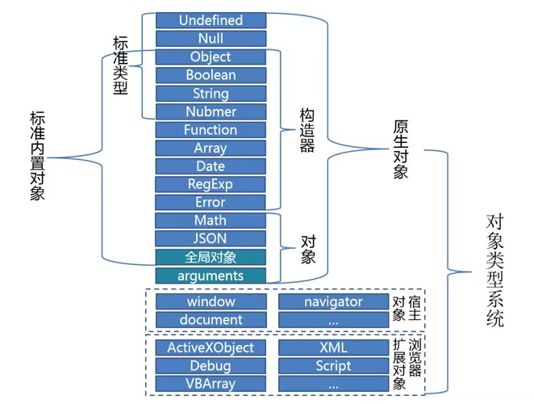

<!-- START doctoc generated TOC please keep comment here to allow auto update -->
<!-- DON'T EDIT THIS SECTION, INSTEAD RE-RUN doctoc TO UPDATE -->

- [Javascript 程序设计](#javascript-%E7%A8%8B%E5%BA%8F%E8%AE%BE%E8%AE%A1)
  - [Javascript 介绍](#javascript-%E4%BB%8B%E7%BB%8D)
  - [调试器](#%E8%B0%83%E8%AF%95%E5%99%A8)
  - [基本语法](#%E5%9F%BA%E6%9C%AC%E8%AF%AD%E6%B3%95)
    - [变量标示符](#%E5%8F%98%E9%87%8F%E6%A0%87%E7%A4%BA%E7%AC%A6)
    - [关键字与保留字](#%E5%85%B3%E9%94%AE%E5%AD%97%E4%B8%8E%E4%BF%9D%E7%95%99%E5%AD%97)
    - [字符敏感](#%E5%AD%97%E7%AC%A6%E6%95%8F%E6%84%9F)
    - [严格模式](#%E4%B8%A5%E6%A0%BC%E6%A8%A1%E5%BC%8F)
    - [注释](#%E6%B3%A8%E9%87%8A)
  - [类型系统](#%E7%B1%BB%E5%9E%8B%E7%B3%BB%E7%BB%9F)
    - [标准类型](#%E6%A0%87%E5%87%86%E7%B1%BB%E5%9E%8B)
  - [内置对象](#%E5%86%85%E7%BD%AE%E5%AF%B9%E8%B1%A1)
  - [表达式与运算符](#%E8%A1%A8%E8%BE%BE%E5%BC%8F%E4%B8%8E%E8%BF%90%E7%AE%97%E7%AC%A6)
  - [语句](#%E8%AF%AD%E5%8F%A5)
  - [变量作用域](#%E5%8F%98%E9%87%8F%E4%BD%9C%E7%94%A8%E5%9F%9F)
  - [闭包](#%E9%97%AD%E5%8C%85)
  - [面向对象](#%E9%9D%A2%E5%90%91%E5%AF%B9%E8%B1%A1)

<!-- END doctoc generated TOC please keep comment here to allow auto update -->

# Javascript 程序设计

## Javascript 介绍

前端开发三要素，`HTML`（描述网页内容），`CSS`（描述样式），`Javascript`（控制网页行为）。Javascript 为解释型编程语言，运行环境也很广泛。


**Javascript**的引入方法如下：

```javascript
<!DOCTYPE html>
<html>
<head>
  <title></title>
</head>
<body>

  <!-- 以上代码忽略 -->

  <!-- 需将 javascript 代码防止在 body 标签的最末端 -->
  <!-- 外联文件 -->
  <script src="/javascripts/application.js" type="text/javascript" charset="utf-8" async defer></script>
  <!-- 内嵌代码 -->
  <style type="text/css">
    console.log('>>> Hello, world!');
  </style>
</body>
</html>
```

## 调试器

调试工具都内置与主流浏览器中（Firefox 中需独立下载 Firebug）。更多关于 Google Chrome DevTools 的信息可以在[这里](https://developer.chrome.com/devtools)找到。

## 基本语法

### 变量标示符

**变量**的命名

```javascript
var _name = null;
var $name = null;
var name0 = null;
```

### 关键字与保留字

Javascript 在语言定义中保留的字段，这些字段在语言使用中存在特殊意义或功能，在程序编写的过程中不可以当做变量或函数名称使用。无需记忆，报错修改既可。

### 字符敏感

字符串的大小写是有所区分的，不同字符指代不同的变量。

### 严格模式


**使用方法**

```javascript
<!-- 全局使用 严格 模式 -->
"use strict";
(function(){
  console.log('>>> Hello, world!');
})()

<!-- 或者在函数内部声明使用 严格 模式 -->
(function(){
  "use strict";
  console.log('>>> Hello, world!');
})()
```

严格模式与标准模式的区别：

- 严格模式下隐式声明或定义变量被静止
- 严格模式下对象重名的属性在严格模式下被静止
- 严格模式下 `arguments.callee()` 被禁用
- 严格模式下 `with()` 语句
- 更多限制

### 注释

```javascript
/*
  多行注释，不可嵌套
 */

// 单行注释
```

## 类型系统



### 标准类型

**原始类型**：

- Undefined
- Null
- Boolean
- String
- Number

**引用类型**：
- Object

```javascript
var obj = {};
<!-- 原始类型变量的包装类型如下 -->
var bool = new Boolean(true);
var str = new String("hello");
var num = new Number(1);
var obj0 = new Object();
```

原始类型和引用类型的区别：

原始类型储存在栈（Stack）中储存变量的值，而引用类型在栈中保存的是所引用内容储存在堆（Heap）中的值。类似于指针的概念，引用类型并非储存变量真实数值而是地址，所以对已引用类型的复制其实只是复制了相同的地址而非实际的变量值。

**Undefined** 值：undefined 出现场景：

- 以声明为赋值的变量 `var obj;`
- 获取对象不存在的属性 `var obj = {x: 0}; obj.y;`
- 无返回值函数的执行结果 `function f(){}; var obj = f();`
- 函数参数没有传入 `function f(i){console.log(i)}; f();`
- `void(expression)`

**Null** 值：null 出现场景：

- 获取不存在的对象 `document.getElementById('not-exist-element')`

**Boolean** 值：true, false 出现场景：

- 条件语句导致的系统执行的隐试类型转换 `if(隐式转换){}`
- 字面量或变量定义 `var bool = true;`

**String** 值：字符串 出现场景：

- `var str = 'Hello, world!';`

**Number** 值：整型直接量，八进制直接量（0-），十六进制直接量（0x-)，浮点型直接量 出现场景：

- `1026`
- `3.14`
- `1.2e5`
- `0x10`

**Object** 值：属性集合 出现场景：

- `var obj = {name: 'Xinyang'};`

|值|Boolean|Number|String|
|--|-------|------|------|
|undefined|false|NaN|"undefined"|
|null|false|0|"null"|
|true|true|1|"null"|
|false|false|0|"false"|
|''|false|0|''|
|'123'|true|123|'123'|
|'1a'|true|NaN|'1a'|
|0|false|0|"0"|
|1|true|1|"1"|
|Infinity|true|Infinity|"Infinity"|
|NaN|false|NaN|'NaN'|
|{}|true|NaN|"[object Object]"|


## 内置对象

## 表达式与运算符

## 语句

## 变量作用域

## 闭包

## 面向对象

