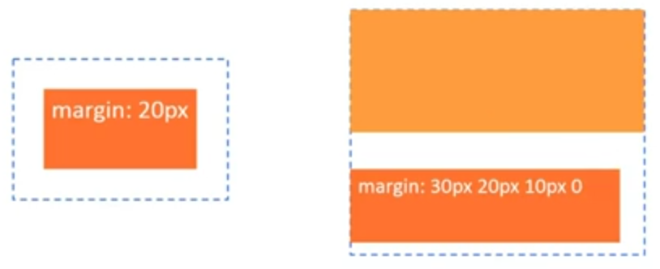
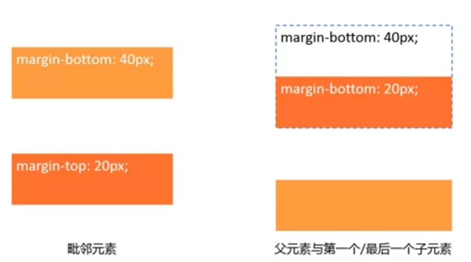
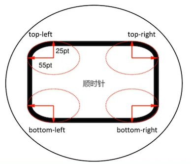

<!-- START doctoc generated TOC please keep comment here to allow auto update -->
<!-- DON'T EDIT THIS SECTION, INSTEAD RE-RUN doctoc TO UPDATE -->
**Table of Contents**  *generated with [DocToc](https://github.com/thlorenz/doctoc)*

- [CSS](#css)
  - [简介](#%E7%AE%80%E4%BB%8B)
  - [语法](#%E8%AF%AD%E6%B3%95)
    - [浏览器私有属性](#%E6%B5%8F%E8%A7%88%E5%99%A8%E7%A7%81%E6%9C%89%E5%B1%9E%E6%80%A7)
    - [属性值语法](#%E5%B1%9E%E6%80%A7%E5%80%BC%E8%AF%AD%E6%B3%95)
      - [基本元素](#%E5%9F%BA%E6%9C%AC%E5%85%83%E7%B4%A0)
      - [组合符号](#%E7%BB%84%E5%90%88%E7%AC%A6%E5%8F%B7)
      - [数量符号](#%E6%95%B0%E9%87%8F%E7%AC%A6%E5%8F%B7)
    - [@规则语法](#@%E8%A7%84%E5%88%99%E8%AF%AD%E6%B3%95)
      - [@规则](#@%E8%A7%84%E5%88%99)
  - [选择器](#%E9%80%89%E6%8B%A9%E5%99%A8)
    - [简单选择器](#%E7%AE%80%E5%8D%95%E9%80%89%E6%8B%A9%E5%99%A8)
      - [标签选择器](#%E6%A0%87%E7%AD%BE%E9%80%89%E6%8B%A9%E5%99%A8)
      - [类选择器](#%E7%B1%BB%E9%80%89%E6%8B%A9%E5%99%A8)
      - [id 选择器](#id-%E9%80%89%E6%8B%A9%E5%99%A8)
      - [通配符选择器](#%E9%80%9A%E9%85%8D%E7%AC%A6%E9%80%89%E6%8B%A9%E5%99%A8)
      - [属性选择器](#%E5%B1%9E%E6%80%A7%E9%80%89%E6%8B%A9%E5%99%A8)
      - [伪类选择器](#%E4%BC%AA%E7%B1%BB%E9%80%89%E6%8B%A9%E5%99%A8)
    - [其他选择器](#%E5%85%B6%E4%BB%96%E9%80%89%E6%8B%A9%E5%99%A8)
      - [伪元素选择器](#%E4%BC%AA%E5%85%83%E7%B4%A0%E9%80%89%E6%8B%A9%E5%99%A8)
      - [组合选择器](#%E7%BB%84%E5%90%88%E9%80%89%E6%8B%A9%E5%99%A8)
      - [选择器分组](#%E9%80%89%E6%8B%A9%E5%99%A8%E5%88%86%E7%BB%84)
    - [继承、优先、层级](#%E7%BB%A7%E6%89%BF%E3%80%81%E4%BC%98%E5%85%88%E3%80%81%E5%B1%82%E7%BA%A7)
      - [继承](#%E7%BB%A7%E6%89%BF)
      - [优先](#%E4%BC%98%E5%85%88)
        - [改变优先级](#%E6%94%B9%E5%8F%98%E4%BC%98%E5%85%88%E7%BA%A7)
      - [层叠](#%E5%B1%82%E5%8F%A0)
  - [文本](#%E6%96%87%E6%9C%AC)
    - [字体](#%E5%AD%97%E4%BD%93)
      - [改变字号](#%E6%94%B9%E5%8F%98%E5%AD%97%E5%8F%B7)
      - [改变字体](#%E6%94%B9%E5%8F%98%E5%AD%97%E4%BD%93)
      - [加粗字体](#%E5%8A%A0%E7%B2%97%E5%AD%97%E4%BD%93)
      - [倾斜字体](#%E5%80%BE%E6%96%9C%E5%AD%97%E4%BD%93)
      - [更改行距](#%E6%9B%B4%E6%94%B9%E8%A1%8C%E8%B7%9D)
      - [font shorthand](#font-shorthand)
      - [改变文字颜色](#%E6%94%B9%E5%8F%98%E6%96%87%E5%AD%97%E9%A2%9C%E8%89%B2)
    - [对齐方式](#%E5%AF%B9%E9%BD%90%E6%96%B9%E5%BC%8F)
      - [文字居中](#%E6%96%87%E5%AD%97%E5%B1%85%E4%B8%AD)
      - [文本垂直对齐](#%E6%96%87%E6%9C%AC%E5%9E%82%E7%9B%B4%E5%AF%B9%E9%BD%90)
      - [文本缩进](#%E6%96%87%E6%9C%AC%E7%BC%A9%E8%BF%9B)
    - [格式处理](#%E6%A0%BC%E5%BC%8F%E5%A4%84%E7%90%86)
      - [保留空格格式](#%E4%BF%9D%E7%95%99%E7%A9%BA%E6%A0%BC%E6%A0%BC%E5%BC%8F)
      - [文字换行](#%E6%96%87%E5%AD%97%E6%8D%A2%E8%A1%8C)
    - [文本装饰](#%E6%96%87%E6%9C%AC%E8%A3%85%E9%A5%B0)
      - [文字阴影](#%E6%96%87%E5%AD%97%E9%98%B4%E5%BD%B1)
      - [文本装饰（下划线等）](#%E6%96%87%E6%9C%AC%E8%A3%85%E9%A5%B0%EF%BC%88%E4%B8%8B%E5%88%92%E7%BA%BF%E7%AD%89%EF%BC%89)
    - [高级设置](#%E9%AB%98%E7%BA%A7%E8%AE%BE%E7%BD%AE)
      - [省略字符](#%E7%9C%81%E7%95%A5%E5%AD%97%E7%AC%A6)
      - [更换鼠标形状](#%E6%9B%B4%E6%8D%A2%E9%BC%A0%E6%A0%87%E5%BD%A2%E7%8A%B6)
      - [强制继承](#%E5%BC%BA%E5%88%B6%E7%BB%A7%E6%89%BF)
  - [盒模型](#%E7%9B%92%E6%A8%A1%E5%9E%8B)
    - [属性](#%E5%B1%9E%E6%80%A7)
      - [width](#width)
      - [height](#height)
      - [padding](#padding)
      - [margin](#margin)
        - [margin 合并](#margin-%E5%90%88%E5%B9%B6)
      - [border](#border)
      - [border-radius](#border-radius)
      - [overflow](#overflow)
      - [box-sizing](#box-sizing)
      - [box-shadow](#box-shadow)
      - [outline](#outline)
    - [TRBL](#trbl)
    - [值缩写](#%E5%80%BC%E7%BC%A9%E5%86%99)
  - [背景](#%E8%83%8C%E6%99%AF)
  - [布局](#%E5%B8%83%E5%B1%80)
  - [变形](#%E5%8F%98%E5%BD%A2)
  - [动画](#%E5%8A%A8%E7%94%BB)

<!-- END doctoc generated TOC please keep comment here to allow auto update -->

## CSS

### 简介

CSS (Cascading Stylesheet) 它用于设置页面的表现。CSS3 并不是一个完整的独立版本而是将不同的功能拆分成独立模块（例如，选择器模块，盒模型模块），这有利于不同功能的及时更新与发布也利于浏览器厂商的实习。


**CSS 引入方法**
```html
// 外部样式表
<head>
  <link rel="stylesheet" type="text/css" href="style.css">
</head>

// 内部样式表
<head>
  <style type="text/css">
    p {
      margin: 10px;
    }
  </style>
</head>

// 内嵌样式(可在动态效果中同 JavaScript 一同使用)
<p style="color: red">Sample Text</p>
```

### 语法

```css
/* 选择器 */
.m-userlist {
  /* 属性声明 */
  margin: 0 0 30px;
  /* 属性名:属性值; */
}
.m-userlist .list {
  position: relative;
  height: 100px;
  overflow: hidden;
}
```

#### 浏览器私有属性

- Google Chrome, Safari (`-webkit`)
- Firefox (`-moz-`)
- IE (`-ms-`)
- Opera (`-o-`)

```css
.pic {
  -webkit-transform: rotate(-3deg);
  -ms-transform: rotate(-3deg);
  transform: rotate(-3deg);
}
```

NOTE: 使用 [http://pleeease.io/play/](http://pleeease.io/play/) ，CSS 预处理器（Sass，Less，Stylus）或编辑器插件可自动添加浏览器厂商的私有属性前缀。

#### 属性值语法

```css
margin: [ <length> | <percentage> | auto ]{1,4}
/* 基本元素：<length>, <percentage>, auto*/
/* 组合符号：[], | */
/* 数量符号：{1,4} */
```

##### 基本元素

**关键字**
- auto
- solid
- bold
- ...

**类型**
- 基本类型
    - `<length>`
    - `<percentage>`
    - `<color>`
    - ...
- 其他类型
    - <'padding-width'>
    - <'color-stop'>
- 符号
    - `/`
    - ','
- inherit, initial

##### 组合符号

- `<'font-size'> <'font-family'>` （` ` 两项必存，顺序毕遵）
    - 合法：`12px arial`
    - 不合法：`2em`
    - 不合法：`arial 14px`
- `<length>&&<color>` (`&&` 两项必存，顺序无碍)
    - 合法：green 2px
    - 合法：1em orange
    - 不合法：blue
- `underline || overline || line-through || blink` (`||` 至少选一，顺序无碍)
    - 合法：underline
    - 合法：overline underline
- `<color> | transparent`（`|` 只可选一，不可共存）
    - 合法：orange
    - 合法：transparent
    - 不合法：orange transparent
- `bold [thin || <length>]`（`[]` 分组之用，视为整体）
    - 合法：bold thin
    - 合法：bold 2em

##### 数量符号

- `<length>`（无则表示仅可出现一次）
    - 合法：1px
    - 合法：10em
    - 不合法：1px 2px
- `<color-stop>[, <color-stop>]+` (`+` 可出现一次或多次)
    - 合法：#fff, red
    - 合法：blue, green 50%, gray
    - 不合法：red
- `inset?&&<color>` (`?` 表示可选)
    - 合法：inset orange
    - 合法：red
- `<length>{2,4}` (`{2,4}` 可出现次数和最少最多出现次数)
    - 合法：1px 2px
    - 合法：1px 2px 3px
    - 不合法: 1px
    - 不合法：1px 2px 3px 4px 5px
- `<time>[, <time>]*`（`*` 出现 0 次或多次）
    - 合法：1s
    - 合法：1s,4ms
- `<time>#`（`#` 出现一次或者多次，用`,`分隔）
    - 合法：2s, 4s
    - 不合法：1s 2s

**CSS 规则示例**


#### @规则语法

```
@import "subs.css";
@charset "utf-8";
@media print {
  /* property: value */
}
@keyframes fadein {
  /* property: value */
}
```

- `@标示符 内容;`
- `@标示符 内容{}`

##### @规则

**常用的规则**
- `@media` （用于响应式布局）
- `@keyframes` （CSS 动画的中间步骤）
- `@font-face` （引入外部字体）

**其他规则**（不常用）
- `@import`
- `@charset`
- `@namespace`
- `@page`
- `@supports`
- `@document`

### 选择器

选择器可被看做表达式，通过它可以选择相应的元素并应用不同的样式。

- 简单选择器
- 元素选择器
- 组合选择器

#### 简单选择器

简单选择器可组合使用。

##### 标签选择器

```html
<div>
  <p>Sample Paragraph</p>
  <p>Sample Paragraph</p>
  <p>Sample Paragraph</p>
</div>

<style type="text/css">
  p {
    color: blue;
  }
</style>
```

##### 类选择器

`.className` 以 `.` 开头，名称可包含字母，数字，`-`，`_`，但必须以字母开头。它区分大小写并可出现多次。

```html
<div>
  <p>Sample Paragraph</p>
  <p class="special bold">Sample Paragraph</p>
  <p>Sample Paragraph</p>
</div>

<style type="text/css">
  p {
    color: blue
  }
  .special {
    color: orange;
  }
  .bold {
    font-weight: bold;
  }
</style>
```

##### id 选择器

`#idName` 以 `#` 开头且只可出现**一次**，其命名要求于 `.className` 相同。

```html
<div>
  <p id="special">Sample Paragraph</p>
</div>

<style type="text/css">
  #special {
    color: red;
  }
</style>
```

##### 通配符选择器

```html
<div>
  <p>Sample Paragraph</p>
  <p>Sample Paragraph</p>
</div>

<style type="text/css">
  * {
    color: blue;
  }
</style>
```

##### 属性选择器

`[attr]` 或 `[attr=val]` 来选择相应的元素。`#nav{...}` 既等同于 `[id=nav]{...}`。 IE7+

`[attr~=val]` 可选用与选择包含 `val` 属性值的元素，像`class="title sports"` 与 `class="sports"`。`.sports{...}` 既等同于 `[class~=sports]{...}`  IE7+

`[attr|=val]` 可以选择`val`开头及开头紧接`-`的属性值。  IE7+

`[attr^=val]` 可选择以`val`开头的属性值对应的元素，如果值为符号或空格则需要使用引号 `""`。  IE7+

`[attr$=val]` 可选择以`val`结尾的属性值对应的元素。 IE7+

`[attr*=val]` 可选择以包含`val`属性值对应的元素。  IE7+

```html
<div>
  <form action="">
    <input type="text" value="Xinyang" disabled>
    <input type="password" placeholder="Password">
    <input type="button" value="Button">
  </form>
</div>
<style type="text/css">
  [disabled] {
    background-color: orange;
  }
  [type=button] {
    color: blue;
  }
</style>
```

##### 伪类选择器

**常用伪类选择器**：
- `:link`
- `:visited` IE7+
- `:hover` IE6中仅可用于链接
- `:active` IE6/7中仅可用于链接
- `:enabled` IE9+
- `:disabled` IE9+
- `:checked` IE9+
- `:first-child`  IE8+
- `:last-child`  IE9+
- `:nth-child(even)` 可为 `odd` `even` 或数字  IE9+
- `:nth-last-child(n)` `n`从 0 开始计算  IE9+
- `:only-child` 仅选择唯一的元素  IE9+
- `:only-of-type`  IE9+
- `:first-of-type` IE9+
- `:last-of-type` IE9+
- `:nth-of-type(even)`  IE9+
- `:nth-last-of-type(2n)`  IE9+

**不常用伪类选择器**：
- `:empty` 选中页面中无子元素的标签
- `:root` 选择 HTML 根标签
- `:not()` 参数为一般选择器 IE9+
- `:target` 被锚点选中的目标元素 IE9+
- `:lang()` 选中语言值为某类特殊值的元素

NOTE：请在使用时查找文档

```html
<div>
  <a href="http://sample-site.com" title="Sample Site">Sample Site</a>
</div>
<style type="text/css">
  /* 伪类属性定义有顺序要求！ */
  a:link {
    color: gray;
  }
  a:visited {
    color:red;
  }
  a:hover {
    color: green;
    /* 鼠标悬停 */
  }
  a:active {
    color: orange;
    /* 鼠标点击 */
  }
</style>
```

#### 其他选择器

##### 伪元素选择器

注意与伪类学则器的区分。

- `::first-letter`
- `::first-line`
- `::before{content: "before"}` 需与 `content` 一同使用 IE8+
- `::after{content: "after"}` 需与 `content` 一同使用 IE8+
- `::selection` 被用户选中的内容（鼠标选择高亮属性）IE9+ Firefox需用 `-moz` 前缀

##### 组合选择器

- 后代选择器 `.main h2 {...}`，使用` `表示 
- 子选择器 `.main>h2 {...}`，使用`>`表示 IE7+
- 兄弟选择器 `h2+p {...}`，使用`+`表示 IE7+
    - `h2~p {...}`，使用`~`表示（此标签无需紧邻）IE7+

##### 选择器分组

```html
<style type="text/css">
/* 下面两组样式声明效果一致 */
h1 {color: red;}
h2 {color: red;}
h3 {color: red;}

h1, h2, h3 {color: red;}
</style>
```

#### 继承、优先、层级

##### 继承

子元素继承父元素的样式，但并不是所有属性都是默认继承的。通过文档中的 `inherited: yes` 来判断属性是否可以自动继承。


自动继承属性：
- color
- font
- text-align
- list-style
- ...

非继承属性：
- background
- border
- position
- ...

##### 优先

CSS Specificity Calculator 可以在[这里](http://specificity.keegan.st/)找到。更多关于 CSS 优先级别的信息可以在[这里](https://css-tricks.com/specifics-on-css-specificity/)找到（英文）。

计算方法：
- a = 行内样式
- b = id 选择器的数量
- c = 类、伪类的属性选择器的数量
- d = 标签选择器和伪元素选择器的数量

NOTE：从上到下优先级一次降低，且优先级高的样式会将优先级低的样式覆盖。大致公式（并不准确）如下。

```
value = a * 1000 + b * 100 + c * 10 + d
```

###### 改变优先级

- 改变样式声明先后顺序
- 提升选择器优先级
- `!important`（慎用）

##### 层叠

层叠为相同属性根据优先级覆盖，如优先级相同则后面会覆盖前面的属性，而不同属性则会合并。

### 文本

#### 字体

##### 改变字号

`font-size: <absolute-size> | <relative-size> | <length> | <percentage> | inherit`

- `<absolute-size>` 有 small large medium
- `<relative-size>` 有 smaller larger

```stylus
div
  font-size 12px
  p#sample0
    font-size 16px
  p#sample1
    font-size 2em
  p#sample2
    font-size 200%
```

NOTE：以上两值在开发中并不常用。`2em` 与 `200%` 都为父元素默认大小的两倍（参照物为父元素的字体大小 `12px`）。

##### 改变字体

`font-family: [ <family-name> | <generic-family> ]# `

`<generic-family>` 可选选项，但具体使用字体由浏览器决定
- serif
- sans-serif
- cursive
- fantasy
- monospace

```css
font-family: arial, Verdana, sans-serif;
```

NOTE：优先使用靠前的字体

##### 加粗字体

`font-weight: normal | bold | bolder | lighter | 100 | 200 | 300 | 400 | 500 | 600 | 700 | 800 | 900`

```css
font-weight: normal;
font-weight: bold;
```

##### 倾斜字体

`font-style: normal | italic | oblique | inherit`

`italic` 使用字体中的斜体，而 `oblique` 在没有斜体字体时强制倾斜字体。

##### 更改行距

`line-height: normal | <number> | <length> | <percentage>`

`normal` 值为浏览器决定，在1.1至1.2之间（通常设置值为1.14左右）

```css
/* length 类型 */
line-height: 40px;
line-height: 3em;
/* percentage 类型 */
line-height: 300%;
/* number 类型 */
line-height: 3;
```

NOTE：当`line-height`为 `number` 类型时，子类直接继承其数值（不计算直接继承）。而当为 `percentage` 类型时，子类则会先计算再显示（先计算后继承）。

##### font shorthand

`font: [ [ <‘font-style’> || <font-variant-css21> || <‘font-weight’> || <‘font-stretch’> ]? <‘font-size’> [ / <‘line-height’> ]? <‘font-family’> ] | caption | icon | menu | message-box | small-caption | status-bar`

```css
font: 30px/2 "Consolas", monospace;
font: italic bold 20px/1.5 arial, serif;
font: 20px arial, serif;
```

NOTE：当其他值为空时，均被设置为默认值。

##### 改变文字颜色

`color: <color>`

```css
element { color: red; }
element { color: #f00; }
element { color: #ff0000; }
element { color: rgb(255,0,0); }
element { color: rgb(100%, 0%, 0%); }
element { color: hsl(0, 100%, 50%); }

/* 50% translucent */
element { color: rgba(255, 0, 0, 0.5); }
element { color: hsla(0, 100%, 50%, 0.5); }

/* 全透明 */
element { color: transparent' }
element { color: rgba(0, 0, 0, 0); }
```

#### 对齐方式

##### 文字居中

`text-align: start | end | left | right | center | justify | match-parent | start end`

NOTE：默认为文本左对齐。

##### 文本垂直对齐

`vertical-align: baseline | sub | super | text-top | text-bottom | middle | top | bottom | <percentage> | <length>`

NOTE：`<percentage>`的参照物为`line-height`

##### 文本缩进

`text-indent: <length> | <percentage> && [ hanging || each-line ]`

NOTE：缩进两个字可使用 `text-indent: 2em;`

#### 格式处理

##### 保留空格格式

`white-space: normal | pre | nowrap | pre-wrap | pre-line`

`pre` 行为同 `<pre>` 一致。

<table class="standard-table">
 <thead>
  <tr>
   <th>&nbsp;</th>
   <th>New lines</th>
   <th>Spaces and tabs</th>
   <th>Text wrapping</th>
  </tr>
 </thead>
 <tbody>
  <tr>
   <th><code>normal</code></th>
   <td>Collapse</td>
   <td>Collapse</td>
   <td>Wrap</td>
  </tr>
  <tr>
   <th><code>nowrap</code></th>
   <td>Collapse</td>
   <td>Collapse</td>
   <td>No wrap</td>
  </tr>
  <tr>
   <th><code>pre</code></th>
   <td>Preserve</td>
   <td>Preserve</td>
   <td>No wrap</td>
  </tr>
  <tr>
   <th><code>pre-wrap</code></th>
   <td>Preserve</td>
   <td>Preserve</td>
   <td>Wrap</td>
  </tr>
  <tr>
   <th><code>pre-line</code></th>
   <td>Preserve</td>
   <td>Collapse</td>
   <td>Wrap</td>
  </tr>
 </tbody>
</table>

##### 文字换行

`word-wrap: normal | break-word`

NOTE：允许长单词自动换行。

`word-break: normal | break-all | keep-all`

NOTE：`break-all` 单词中的任意字母间都可以换行。

#### 文本装饰

##### 文字阴影

`text-shadow:none | <shadow-t>#` 或 `text-shadow:none | [<length>{2,3}&&<color>?]#`

```css
p {
  text-shadow: 1px 1px 1px #000,
               3px 3px 5px blue;
}
```

1. value = The X-coordinate X 轴偏移像素
2. value = The Y-coordinate Y 轴偏移像素
3. value = The blur radius  阴影模糊半径
4. value = The color of the shadow 阴影颜色（默认为文字颜色）

##### 文本装饰（下划线等）

`text-decoration: <'text-decoration-line'> || <'text-decoration-style'> || <'text-decoration-color'>`

```css
h1.under {
    text-decoration: underline;
}
h1.over {
    text-decoration: overline;
}
p.line {
    text-decoration: line-through;
}
p.blink {
    text-decoration: blink;
}
a.none {
    text-decoration: none;
}
p.underover {
    text-decoration: underline overline;
}
```

#### 高级设置

##### 省略字符

`text-overflow: [ clip | ellipsis | <string> ]{1,2}`

```css
/* 常用配合 */
text-overflow: ellipsis;
overflow: hidden; /* 溢出截取 */
white-space: nowrap; /* 禁止换行 */
```

##### 更换鼠标形状

`cursor: [[<funciri>,]* [ auto | crosshair | default | pointer | move | e-resize | ne-resize | nw-resize | n-resize | se-resize | sw-resize | s-resize | w-resize| text | wait | help ]] | inherit`

**常用属性**

`cursor: [<uri>,]*[auto | default | none | help | pointer | zoom-in | zoom-out | move]`

- `<uri>` 图片资源地址代替鼠标默认形状
- `<default>` 默认光标
- `<none>` 隐藏光标
- `<pointer>` 手型光标
- `<zoom-in>`
- `<zoom-out>`
- `<move>`

```css
cursor: pointer;
cursor: url(image-name.cur), pointer;
/* 当 uri 失效时或者则会起作用 */
```

##### 强制继承

`inherit` 会强制继承父元素的属性值。

```css
font-size: inherit;
font-family: inherit;
font-weight: inherit;
...
word-wrap: inherit;
work-break: inherit
text-showdow: inherit
```

NOTE：具体在使用时可查询文档

### 盒模型

#### 属性


##### width

**内容盒子宽**

`width: <length> | <percentage> | auto | inherit`

NOTE：通常情况下百分比得参照物为元素的父元素。`max-width` 与 `min-width` 可以设置最大与最小宽度。

##### height

**内容盒子高**

`height: <length> | <percentage> | auto | inherit`

NOTE：默认情况元素的高度为内容高度。`max-height` 与 `min-height` 可以设置最大与最小高度。

##### padding


`padding: [<length> | <percentage>]{1,4} | inherit`

##### margin



`margin: [<length> | <percentage> | auto]{1,4} | inherit`

NOTE：`margin` 默认值为 `auto`

Trick：

```
/* 可用于水平居中 */
margin: 0 auto;
```

###### margin 合并



毗邻元素外间距（margin）会合并，既取相对较大的值。父元素与第一个和最后一个子元素的外间距也可合并。

##### border


```
border: [<br-width> || <br-style> || <color>] | inherit
border-width: [<length> | thin | medium | thick]{1,4} | inherit
border-style: [solid | dashed | dotted | ...]{1,4} |inherit
border-colro: [<color> | transparent]{1,4} | inherit
```

NOTE：`border-color` 默认为元素字体颜色。

##### border-radius


```
/* 水平半径/垂直半径 */
border-radius: [ <length> | <percentage> ]{1,4} [ / [ <length> | <percentage> ]{1,4} ]?
```

NOTE：四个角的分解属性由左上角顺时针附值。

##### overflow


`overflow: visible | hidden | scroll | auto`

NOTE：默认属性为 `visible`。使用 `overflow-x` 与 `overflow-y` 单独的设置水平和垂直方向的滚动条。

##### box-sizing


`box-sizing: content-box | border-box | inherit`

- `content-box` = 内容盒子宽高 + 填充（`Padding`）+ 边框宽（`border-width`）
- `border-box` = 内容盒子宽高

##### box-shadow


`box-shadown: none | [inset? && [ <offset-x> <offset-y> <blur-radius>? <spread-radius>? <color>? ] ]#`

```html
box-shadow: 4px  6px   3px  0px red;
             |    |     |    |
          水平偏移|     |    |
               垂直偏移 |    |
                    模糊半径 |
                          阴影大小
```

NOTE：水平与垂直偏移可以为负值即相反方向偏移。颜色默认为文字颜色。阴影不占据空间，仅为修饰效果。

##### outline

```
outline: [ <'outline-color'> || <'outline-style'> || <'outline-width'> ]
outline-width: <length> | thin | medium | thick | inherit
outline-style: solid | dashed | dotted | ... | inherit
outline-color: <color> | invert | inherit
/* invert 与当前颜色取反色 */
```

NOTE：`outline` 与 `border` 相似但无法分别设置四个方向的属性。`outline` 并不占据空间，而 `border` 占据空间，且显示位于 `border` 以外。

#### TRBL




TRBL (Top, Right, Bottom, Left) 即为顺时针从顶部开始。具有四个方向的属性都可以通过 `*-top` `*-right` `*-bottom` 与 `*-left` 单独对其进行设置。

#### 值缩写

下面的值缩写以 `padding` 为例。

> 对面相等，后者省略；四面相等，只设一个。

```html
/*      四面值 */
padding: 20px;
padding: 20px 20px 20px 20px;

/*      上下值 右左值 */
padding: 20px   10px;
padding: 20px 10px 20px 10px;

/*       上值 右左值 下值 */
padding: 20px 10px   30px;
padding: 20px 10px 30px 10px;
```

### 背景

### 布局

**Gecko Reflow Visualisation**


### 变形

### 动画
