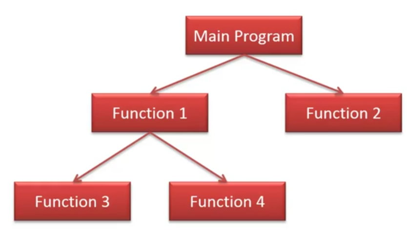
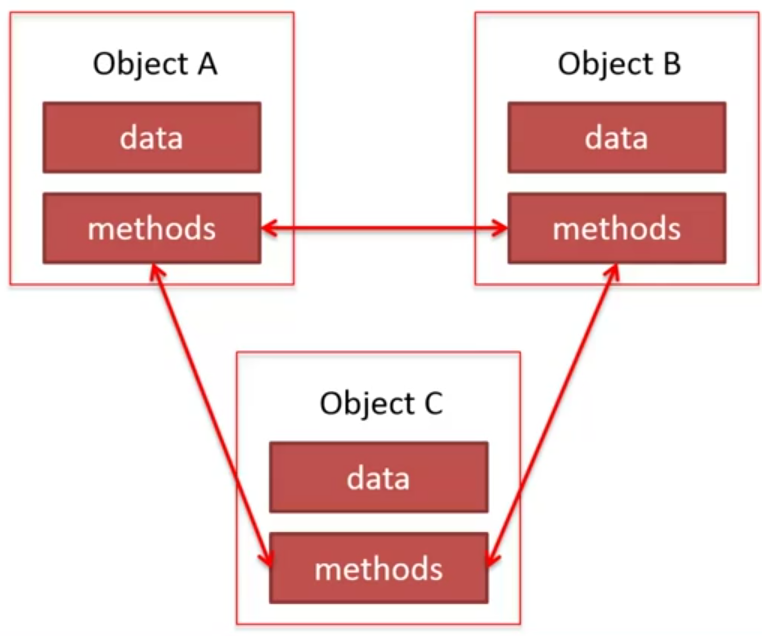

<!-- START doctoc generated TOC please keep comment here to allow auto update -->
<!-- DON'T EDIT THIS SECTION, INSTEAD RE-RUN doctoc TO UPDATE -->
**Table of Contents**  *generated with [DocToc](https://github.com/thlorenz/doctoc)*

- [面向对象](#%E9%9D%A2%E5%90%91%E5%AF%B9%E8%B1%A1)

<!-- END doctoc generated TOC please keep comment here to allow auto update -->

## 面向对象

### 程序设计方法

程序设计描述系统如何通过程序来实现的过程，其为一种设计方法与语言实现无关。常见的设计方法有面向流程与面向对象。

#### 面向过程

以程序的过程为中心，采用自定而下逐步细化的方法来实现。常见的面向过程语言有 C、Fortran、Pascall。



#### 面向对象

将对象作为程序的基本单元，将程序分解为数据和操作的集合。常见的面向过程语言有 smalltalk（也是 Objective-C 的父亲）、Java、C++。



##### 概念

- 类（Class）、对象（Object）
- 属性（Property）、方法（Method）

##### 基本特点

- 继承（Inheritance）
- 封装（Encapsulation）
- 多态（Polymorphism）

## JavaScript 面向对象

### constructor

对象的构造器，也可称之为构造类型。

```javascript
// 使用 new 关键字创建
var o = new Object();
var a = new Array();
var d = new Date();
    |         |
 object    constructor

// 使用直接量创建
var o = {name: 'Xinyang'};
var a = [1, 2, 3];
```

#### 自定义构造器

```javascript
// constructor
function Person(name, age, birthdate) {
  this.name = name;
  this.age = age;
  this.birthdate = birthdate;
  this.changeName = function(newAge) {
    this.age = newAge;
  }
}

// 创建对象
var X = new Person('Stupid', 13, new Date(2015, 01, 01));
var Q = new Person('Q', 12, new Date(2015, 01, 01));

X.changeName('X');
```

##### 创建构造器的方法（3 种）

- `function ClassName() {...}`
- `var Class = function() {...}`
- `var Class = new Function()`

NOTE: 并不是所有函数都可以被当成构造器，例如 `var o = new Math.min()`。通常自定义的函数均可当做构造器来使用。内置对象的构造器也可被当做构造器。

NOTE+：如果构造器有返还值并为对象类型，则对象将被直接返回。

```javascript
function Person(name, age, birthdate) {
  this.name = name;
  this.age = age;
  this.birthdate = birthdate;
  this.changeName = function(newAge) {
    this.age = newAge;
  }
  // !!! 注意这里
  return {};
}

var X = new Person('X', 13, new Date());
console.log(X.name); // undefined;
```

### this

`this` 在不同环境中指代的对象不同（`this` 指代的值可在函数运行过程中发生改变）。

|出现场景|所指代值|
|--------|--------|
|全局环境|全局对象（window 在浏览器环境中时）|
|constructor|创建的新实例对象|
|函数调用|函数的调用者|
|`new Function()`|全局对象|
|`eval()`|调用上下文中的 `this`|

#### 全局环境中

全局环境中 `this` 指代全局对象，既 `window` 在浏览器环境中。

```javascript
// 以下的所有 this 均指代全局对象
var a = 10;
alert(this.a);

this.b = 20;
alert(b);

c = 30;
alert(this.c);
```

#### 构造器中

构造器中的 `this` 指代的是即将被创建出的对象。

```javascript
// constructor
function Person(name, age, birthdate) {
  // 下面的指代即将被创建的对象
  this.name = name;
  this.age = age;
  this.birthdate = birthdate;
  this.changeName = function(newAge) {
    this.age = newAge;
  }
}

// 创建对象
var X = new Person('Stupid', 13, new Date(2015, 01, 01));
var Q = new Person('Q', 12, new Date(2015, 01, 01));

X.changeName('X');
```

#### 函数中

函数中的 `this` 指代函数的调用者。

```javascript
// constructor
function Person(name, age, birthdate) {
  // 下面的指代即将被创建的对象
  this.name = name;
  this.age = age;
  this.birthdate = birthdate;
  this.changeName = function(newAge) {
    this.age = newAge;
  }
  this.gretting = function() {
    // !!! 下面这个 this 指代调用它的对象，既上面的
    // 上面的 gretting 左边的 this，既为即将被创建的对象
    console.log('Hi, I am ' + this.name)
  }
}

// 创建对象
var X = new Person('Stupid', 13, new Date(2015, 01, 01));

X.changeName('X');
X.gretting();
```

NOTE: `new Function('console.log(this)')` 中的 `this` 均指代全局对象。`eval('console.log(this)` 则为调用上下文指代的 `this`。

### this 实例

下面的例子使用 `apply` 与 `call`。通过这两个方法来将一个对象中 `this` 指代的目标进行改变。

```javascript
function Point(x, y) {
  this.x = x;
  this.y = y;
  this.move = function(x, y) {
    this.x += x;
    this.y += y;
  }
}

var point = new Point(0, 0);
point.move(1, 1);

var circle = {x: 0, y: 1, r: 1};

// 改变 point 中 move 方法 this 指代的对象至 circle
point.move.apply(circle, [1, 1]);
// 同样可以用类似的 call 方法，区别为参数需依次传入
point.move.call(circle, 1, 1);
```


### 原型继承

### 原型链

### 面向对象的应用
