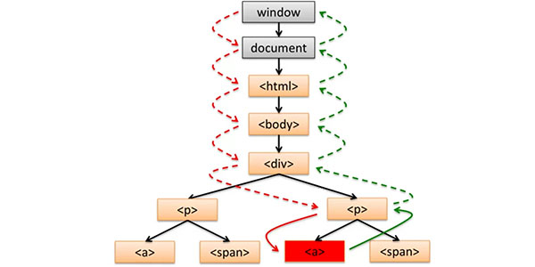
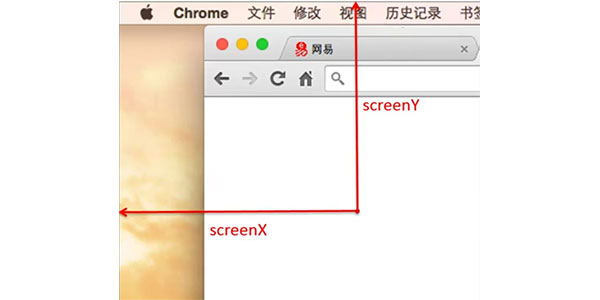

<!-- START doctoc generated TOC please keep comment here to allow auto update -->
<!-- DON'T EDIT THIS SECTION, INSTEAD RE-RUN doctoc TO UPDATE -->
**Table of Contents**  *generated with [DocToc](https://github.com/thlorenz/doctoc)*

- [DOM 事件](#dom-%E4%BA%8B%E4%BB%B6)
  - [事件流](#%E4%BA%8B%E4%BB%B6%E6%B5%81)
  - [事件注册](#%E4%BA%8B%E4%BB%B6%E6%B3%A8%E5%86%8C)
    - [注册事件](#%E6%B3%A8%E5%86%8C%E4%BA%8B%E4%BB%B6)
    - [取消事件](#%E5%8F%96%E6%B6%88%E4%BA%8B%E4%BB%B6)
    - [触发事件](#%E8%A7%A6%E5%8F%91%E4%BA%8B%E4%BB%B6)
    - [浏览器兼容型](#%E6%B5%8F%E8%A7%88%E5%99%A8%E5%85%BC%E5%AE%B9%E5%9E%8B)
      - [兼容低版本代码实现](#%E5%85%BC%E5%AE%B9%E4%BD%8E%E7%89%88%E6%9C%AC%E4%BB%A3%E7%A0%81%E5%AE%9E%E7%8E%B0)
  - [事件对象](#%E4%BA%8B%E4%BB%B6%E5%AF%B9%E8%B1%A1)
    - [属性和方法](#%E5%B1%9E%E6%80%A7%E5%92%8C%E6%96%B9%E6%B3%95)
      - [通用属性和方法](#%E9%80%9A%E7%94%A8%E5%B1%9E%E6%80%A7%E5%92%8C%E6%96%B9%E6%B3%95)
        - [阻止事件传播](#%E9%98%BB%E6%AD%A2%E4%BA%8B%E4%BB%B6%E4%BC%A0%E6%92%AD)
        - [阻止默认行为](#%E9%98%BB%E6%AD%A2%E9%BB%98%E8%AE%A4%E8%A1%8C%E4%B8%BA)
  - [事件分类](#%E4%BA%8B%E4%BB%B6%E5%88%86%E7%B1%BB)
    - [Event](#event)
      - [window](#window)
      - [image](#image)
    - [UIEvent](#uievent)
    - [MouseEvent](#mouseevent)
      - [属性](#%E5%B1%9E%E6%80%A7)
      - [MouseEvent 顺序](#mouseevent-%E9%A1%BA%E5%BA%8F)
        - [实例：拖动元素](#%E5%AE%9E%E4%BE%8B%EF%BC%9A%E6%8B%96%E5%8A%A8%E5%85%83%E7%B4%A0)
    - [滚轮事件（Wheel）](#%E6%BB%9A%E8%BD%AE%E4%BA%8B%E4%BB%B6%EF%BC%88wheel%EF%BC%89)
    - [FocusEvent](#focusevent)
    - [InputEvent](#inputevent)
    - [KeyboardEvent](#keyboardevent)
  - [事件代理](#%E4%BA%8B%E4%BB%B6%E4%BB%A3%E7%90%86)

<!-- END doctoc generated TOC please keep comment here to allow auto update -->

## DOM 事件

何为 DOM 事件，HTML DOM 使JavaScript 有能力对 HTML 事件做出反应。（例如，点击 DOM 元素，键盘被按，输入框输入内容以及页面加载完毕等）

### 事件流

一个 DOM 事件可以分为`捕获过程`、`触发过程`、`冒泡过程`。
DOM 事件流为 DOM 事件的处理及执行的过程。下面以一个`<a>`元素被点击为例。



1. [红虚线]Capture Phase（事件捕获过程）当 DOM 事件发生时，它会从window节点一路跑下去直到触发事件元素的父节点为止，去捕获触发事件的元素。
2. [红绿实线]Target Phase（事件触发过程）当事件被捕获之后就开始执行事件绑定的代码
3. [绿虚线]Bubble Phase（冒泡过程）当事件代码执行完毕后，浏览器会从触发事件元素的父节点开始一直冒泡到window元素（**即元素的祖先元素也会触发这个元素所触发的事件**）

NOTE：低版本 IE 中并未实现捕获过程。也不是所有事件均存在这三个完整的过程（例如 `load` 没有冒泡事件）

NOTE+：在这三个阶段中无论将**事件捕获**和**事件处理**注册到任意一个父或祖父节点上都会被触发事件。

### 事件注册

事件注册，取消以及触发其作用对象均为一个 DOM 元素。

#### 注册事件

```javascript
eventTarget.addEventListener(type, listener[,useCapture])
```

- evenTarget 表示要绑定事件的DOM元素
- type    表示要绑定的事件，如："click"
- listener  表示要绑定的函数
- useCapture  可选参数，表示是否捕获过程

NOTE：`useCapture` 为设定是否为捕获过程，默认事件均为冒泡过程，只有 `useCapture` 为 `true` 时才会启用捕获过程。

```javascript
// 获取元素
var elem = document.getElemenyById('id');

// 事件处理函数
var clickHandler = function(event) {
  // statements
};

// 注册事件
elem.addEventListener('click', clickHandler, false);

// 第二种方式，不建议使用
elem.onclick = clickHandler;
// 或者来弥补只可触发一个处理函数的缺陷
elem.onclick = function(){
  clickHandler();
  func();
  // 其他处理函数
};
```

#### 取消事件

```javascript
eventTarget.removeEventListener(type, listener[,useCapture]);
```

- evenTarget 表示要绑定事件的DOM元素
- type    表示要绑定的事件，如："click"
- listener  表示要绑定的函数
- useCapture  可选参数，表示是否捕获过程

```javascript
// 获取元素
var elem = document.getElemenyById('id');

// 取消事件
elem.removeEventListener('click', clickHandler, false);

// 第二种方式。不建议使用
elem.onclick = null;
```

#### 触发事件

点击元素，按下按键均会触发 DOM 事件，当然也可以以通过代码来触发事件。

```javascript
eventTarget.dispatchEvent(type);

// 获取元素
var elem = document.getElemenyById('id');

// 触发事件
elem.dispatchEvent('click');
```

#### 浏览器兼容型

以上均为 **W3C**定义的标准定义，但早期浏览器 IE8 及其以下版本，均没有采用标准的实现方式。不过这些低版本浏览器也提供了对于 DOM 事件的注册、取消以及触发的实现。

**事件注册与取消**，`attchEvent/detachEvent`。**事件触发**，`fireEvent(e)`，其也**不存在**捕获阶段（Capture Phase）。


##### 兼容低版本代码实现

**注册事件**

```javascript
var addEvent = document.addEventListener ?
  function(elem, type, listener, useCapture) {
    elem.addEventListener(type, listener, useCapture);
  } :
  function(elem, type, listener, useCapture) {
    elem.attachEvent('on' + type, listener);
  }
```

**取消事件**

```javascript
var addEvent = document.removeElementListener ?
  function(elem, type, listener, useCapture) {
    elem.removeElementListener(type, listener, useCapture);
  } :
  function(elem, type, listener, useCapture) {
    elem.detachEvent('on' + type, listener);
  }
```

### 事件对象

调用事件处理函数时传入的信息对象，这个对象中含有关于这个事件的详细状态和信息，它就是事件对象 `event`。其中可能包含鼠标的位置，键盘信息等。

```javascript
// 获取元素
var elem = document.getElemenyById('id');

// 事件处理函数
var clickHandler = function(event) {
  // statements
};

// 注册事件
elem.addEventListener('click', clickHandler, false);
```

NOTE：在低版本 IE 中事件对象是被注册在 `window` 之上而非目标对象上。使用下面的兼容代码既可解决。

```javascript
var elem = document.getElemenyById('id');

// 事件处理函数
var clickHandler = function(event) {
  event = event || window.event;
  // statements
};
```

#### 属性和方法

##### 通用属性和方法

**属性**

- type 事件类型
- target(srcElement IE 低版本) 事件触发节点
- currentTarget 处理事件的节点

**方法**

- stopPropagation 阻止事件冒泡传播
- preventDefault 阻止默认行为
- stopImmediatePropagation 阻止冒泡传播

###### 阻止事件传播

`event.stopPropagation()`（W3C规范方法），如果在当前节点已经处理了事件，则可以阻止事件被冒泡传播至 DOM 树最顶端即 `window` 对象。

`event.stopImmediatePropagation()` 此方法同上面的方法类似，除了阻止将事件冒泡传播值最高的 DOM 元素外，还会阻止在此事件后的事件的触发。

`event.cancelBubble=true` 为 IE 低版本中中对于阻止冒泡传播的实现。

###### 阻止默认行为

默认行为是指浏览器定义的默认行为（点击一个链接的时候，链接默认就会打开。当我们双击文字的时候，文字就会被选中），比如单击链接可以打开新窗口。

`Event.preventDefault()` 为 W3C 规范方法，在 IE 中的实现方法为 `Event.returnValue=false`。

### 事件分类

#### Event


|事件类型|是否冒泡|元素|默认事件|元素例子|
|--------|--------|----|--------|--------|
|load|NO|Window, Document, Element|None|window, image, iframe|
|unload|NO|Window, Document, Element|None|window|
|error|NO|Window, Element|None|window, image|
|select|NO|Element|None|input, textarea|
|abort|NO|Window, Element|None|window, image|

##### window

- load 页面全部加载完毕
- unload 离开本页之前的卸载
- error 页面异常
- abort 取消加载

##### image

- load 图片加载完毕
- error 图标加载错误
- abort 取消图标加载

在目标图标不能正常载入时，载入备份替代图来提供用户体验。

```javascript

```

#### UIEvent

|事件类型|是否冒泡|元素|默认事件|元素例子|
|--------|--------|----|--------|--------|
|resize|NO|Window, Element|None|window, iframe|
|scroll|NO/YES|Document, Element|None|document, div|

NOTE：`resize` 为改变浏览器或`iframe`的窗体大小时会触发事件，`scroll` 则会在滑动内容时触发，作用于 `Document` 则不会冒泡，作用于内部元素则会冒泡。

#### MouseEvent

DOM 事件中最常见的事件之一。

|事件类型|是否冒泡|元素|默认事件|元素例子|
|--------|--------|----|--------|--------|
|click|YES|Element|focus/activation|div|
|dbclick|YES|Element|focus/activation/select|div|
|mousedown|YES|Element|drag/scroll/text selection|div|
|mosuemove|YES|Element|None|div|
|mouseout|YES|Element|None|div|
|mouseover|YES|Element|None|div|
|mouseup|YES|Element|context menu|div|
|mouseenter|NO|Element|None|div|
|mouseleave|NO|Element|None|div|

NOTE：`mouseenter` 与 `mouseover` 的区别为前者在鼠标在子元素直接移动不会触发事件，而后者会触发。
`mouseleave` 与 `mouseout` 同上相似。

##### 属性

- clientX, clientX
- screenX, screenY
- ctrlKey, shiftKey, altKey, metaKey 如果被按下则为真（true）
- button(0, 1, 2) 鼠标的间位



##### MouseEvent 顺序

鼠标的移动过程中会产生很多事件。事件的监察频率又浏览器决定。

**例子：从元素 A 上方移动过**

mousemove -> mouseover(A) -> mouseenter(A) -> mousemove(A) -> mouseout(A) -> mouseleave(A)

**例子：点击元素**

mousedown -> [mousemove] -> mouseup -> click

###### 实例：拖动元素

```html
<div id="div0"></div>
<style media="screen">
  #div0 {
    position: absolute;
    top: 0;
    left: 0;
    width: 100px;
    height: 100px;
    border: 1px solid black;
  }
</style>
```

```javascript
var elem = document.getElemenyById('div0');
var clientX, clientY, isMoving;
var mouseDownHandler = function(event) {
  event = event || window.event;
  clientX = event.clientX;
  clientY = event.clientY;
  isMoving = true;
}

var mouseMoveHandler = function(event) {
  if (!isMoving) return;
  event = event || window.event;
  var newClientX = event.clientX,
      newClientY = event.clientY;
  var left = parseInt(elem.style.left) || 0,
      top = parseInt(elem.style.top) || 0;
  elem.style.left = left + (newClientX - clientX) + 'px';
  elem.style.top = top + (newClientY - clientY) + 'px';
  clientX = newClientX;
  clientY = newClientY;
}

var mouseUpHandler = function() {
  isMoving = false;
}

addEvent(elem, 'mousedown', mouseDownHandler);
addEvent(elem, 'mouseup', mouseUpHandler);
addEvent(elem, 'mousemove', mouseMoveHandler);
```

#### 滚轮事件（Wheel）

|事件类型|是否冒泡|元素|默认事件|元素例子|
|--------|--------|----|--------|--------|
|wheel|YES|Element|scroll or zoom document|div|

**属性**

- deltaMode 鼠标滚轮偏移量的单位
- deltaX
- deltaY
- deltaZ

#### FocusEvent

其用于处理元素获得或失去焦点的事件。（例如输入框的可输入状态则为获得焦点，点击外部则失去焦点）

|事件类型|是否冒泡|元素|默认事件|元素例子|
|--------|--------|----|--------|--------|
|blur|NO|Window, Element|None|window, input|
|focus|NO|Window, Element|None|window, input|
|focusin|NO|window, Element|None|window, input|
|focusout|NO|window, Element|None|window, input|

NOTE：`blur` 失去焦点时，`focus` 获得焦点时，`focusin` 即将获得焦点，`focusout`即将失去焦点。

**属性**

一个元素失去，既另一个元素获得焦点。这里的 `relatedTarget` 则为相对的那个元素。

- relatedTarget

#### InputEvent

输入框输入内容则会触发输入事件。

|事件类型|是否冒泡|元素|默认事件|元素例子|
|--------|--------|----|--------|--------|
|beforeInput|YES|Element|update DOM Element|input|
|input|YES|Element|None|input|

NOTE：`beforeInput` 为在按键按下后即将将输入字符显示之前生成的事件。

NOTE+：IE 并没有 `InputEvent` 则需使用 `onpropertychange(IE)` 来代替。

#### KeyboardEvent

其用于处理键盘事件。

|事件类型|是否冒泡|元素|默认事件|元素例子|
|--------|--------|----|--------|--------|
|keydown|YES|Element|beforeInput/input/focus/blur/activation|div, input|
|keyup|YES|Element|None|div, input|

**属性**

- key 按下的键字符串
- code
- ctrlKey, shiftKey, altKey, metaKey
- repeat 代表按键不松开为 true
- keyCode
- charCode
- which

### 事件代理

事件代理是指在父节点上（可为元素最近的父节点也可为上层的其他节点）处理子元素上触发的事件，其原理是通过事件流机制而完成的。可以通过**事件对象**中获取到触发事件的对象（如下所示）。

```javascript
var elem = document.getElemenyById('id');
elem.addEventListener('click', function(event) {
  var e = event || window.event;
  var target = e.target || e.srcElement;
  // statements
});
```

**优点**

- 需要管理的事件处理函数更少
- 内存分配更少，更高效
- 增加与删除子节点可以不额外处理事件

**缺点**

- 事件管理的逻辑变的复杂（因为冒泡机制）