## 表单操作

表单为页面的主要组成部分，其中包含许多的表单控件。用户通过控件提供数据并提交给服务器，服务器则做出相应的处理。而编写一个正常工作的表单需要三个部分：

1. 构建表单
2. 服务器处理（提供接受数据接口）
3. 配置表单

**构建表单**


```HTML
<form>
  <p><label>姓名：<input></label></p>
  <p><label>电话：<input type="tel"></label></p>
  <p><label>邮箱：<input type="email"></label></p>
  <fieldset>
    <legend> 披萨大小 </legend>
    <label><input type="radio" name="size"> 小 </label>
    <label><input type="radio" name="size"> 中 </label>
    <label><input type="radio" name="size"> 大 </label>
  </fieldset>
  <fieldset>
    <legend> 披萨配料 </legend>
    <label><input type="checkbox"> 熏肉 </input></label>
    <label><input type="checkbox"> 奶酪 </input></label>
    <label><input type="checkbox"> 洋葱 </input></label>
    <label><input type="checkbox"> 蘑菇 </input></label>
  </fieldset>
  <p><label>配送时间：<input type="time" min="11:00" max="2100" step="900"></label></p>
  <p><button>提交订单</button></p>
</form>
```

**服务器处理**

提供接口地址（例如，`https://pizza.example.com/order`，数据格式(`application/x-www-form-urlencoded`)，还是接受的参数信息(custname、custtel、custemail、size、topping、delivery)。

数据命名需在表单控件中注明。

**配置表单**

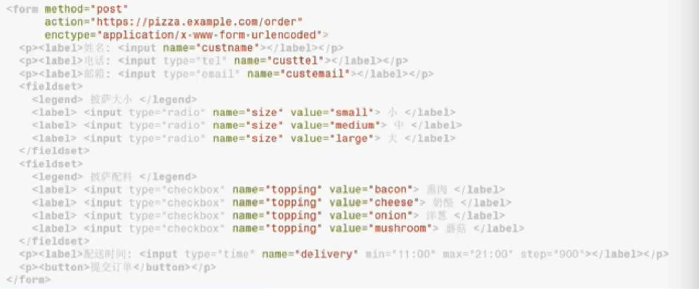

```HTML
<form action="https://pizza.example.com/order" method="post" enctype="application/x-www-form-urlencoded">
  <p><label>姓名：<input name="custname"></label></p>
  <p><label>电话：<input type="tel" name="custtel"></label></p>
  <p><label>邮箱：<input type="email" name="custemail"></label></p>
  <fieldset>
    <legend> 披萨大小 </legend>
    <label><input type="radio" name="size" value="small"> 小 </label>
    <label><input type="radio" name="size" value="medium"> 中 </label>
    <label><input type="radio" name="size" value="large"> 大 </label>
  </fieldset>
  <fieldset>
    <legend> 披萨配料 </legend>
    <label><input type="checkbox"> 熏肉 </input></label>
    <label><input type="checkbox"> 奶酪 </input></label>
    <label><input type="checkbox"> 洋葱 </input></label>
    <label><input type="checkbox"> 蘑菇 </input></label>
  </fieldset>
  <p><label>配送时间：<input type="time" min="11:00" max="2100" step="900"></label></p>
  <p><button>提交订单</button></p>
</form>
```

用户所有提交的信息需在提交服务器前对其进行验证从而提高用户体验。

NOTE：**表单验证** 使用 `require` 来强制用户填写相应的信息。

### 内容

#### 元素

##### form 元素

**form** 元素为构建表单中最重要的元素。

```html
<form novalidate name="pizza" target="abc" method="post" autocomplete="off" accept-charset="utf-8" action="http://pizza.example.com/order" enctype="application/x-www-form-urlencoded">
```

其对应的信息则可以视为

| 字段          | 值                                |
| ------------- | --------------------------------- |
| noValidate    | true                              |
| target        | abc                               |
| method        | post                              |
| acceptCharset | utf-8                             |
| action        | http://pizza.example.com/order    |
| enctype       | application/x-www-form-urlencoded |
| name          | pizza                             |
| autocomplete  | off                               |

NOTE：前六项为表单提交相关的信息。

###### 属性

- `name` 属性可以用于获取表单节点元素。

```javascript
var pizzaForm = document.forms.pizza;
```

- `autocomplete` 有两个值 `on` 与 `off`，在设置为 `on` 时，可以自动对输入框进行补全（之前提交过的输入值，下图左）。

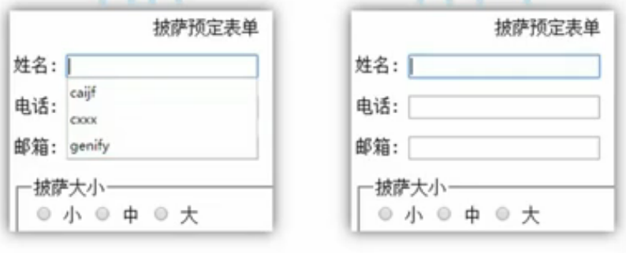

NOTE：在已经设置 `autocomplete="off"` 时依然出现提示框，大多数情况为浏览器设置的自动补全（可以强制关闭，需要时请搜索对应的解决方案）。

- `elements` 为一个**动态节点集合**（更具 DOM 的变化进行变化），其用于归结该表单的子孙表单控件（除图标按钮外 `<input type="image>"`）:

- button
- fieldset
- input
- keygen
- object
- output
- select
- textarea

此外还有归属于该表单的空间（依旧图片按键除外）代码如下所示。

```html
<form id="a">
</form>
<label><input name="null" form="a"></label>
```

- `length` 等价于 `elements.length` 来用于描述表单内节点集合的个数。

###### 选取表单空间元素

```html
<form name="test">
  <input name="a">
  <input name="b">
</form>
```

选取 `name="a"` 的控件可以使用下面的方法：

```javascript
testForm.elements[0];
testForm.elements['a'];

// 操作 Form 表单的属性
testForm[0];
testForm['a'];
```

- `form[name]` 通过名称作为索引时有如下特点：

  - 返回 `id` 或者 `name` 为制定名称的表单空间（图标按键除外）
  - 如果结果为空，则返回`id` 为指定名称的 `img` 元素（入下面代码所示）
  - 如果有多个同名元素，则返回的元素为动态节点集合
  - 一旦用指定名称取过改元素，之后则不论该元素的 `id` 或者 `name` 如何变化，只有节点存在则均可使用**原名称**来继续获取改节点。

*无指定名称索引范例*

```html
<form name="test">
  
</form>
```

```javascript
testForm['a']; // 取得的便是 id 为 a 的图片元素
```

*更新名称，依然可以获取节点范例*

```html
<form name="test">
  <input name="a">
</form>
```

```javascript
// 第一步
testForm['a'];
// 或者
testForm.elements['a'];

// 第二步
testForm['a'].name = 'b';
```


###### form 接口

`form` 元素也提供了一些接口便于对其进行操作 `reset()` `submit()` `checkValidity()`。

可以重置（reset）的元素有下面的几种：

- input
- keygen
- output
- select
- textarea

当触发表单 `reset` 事件时可使用阻止该事件的默认行为来取消重置。而且元素重置时将不会再次触发元素上的 `change` 与 `input` 事件。


##### label 元素

```html
<label for="textId" form="formId">
```

| 字段    | 值                     |
| ------- | ---------------------- |
| htmlFor | textId                 |
| control | HTMLElement#textId     |
| form    | HTMLFormElement#formId |

`htmlFor` 用于关联表单控件的激活行为（可使点击 `label` 与点击表单控件的行为一致），可关联的元素有下列（`hidden` 除外）：

- button
- input
- keygen
- meter
- output
- progress
- select
- textarea

*自定义文件提交控件样式*


`control` 如果指定了 `for` 属性则制定该`for` 属性对于 `id` 的可关联元素。如果没有指定 `for` 属性则为第一个可关联的子孙元素。

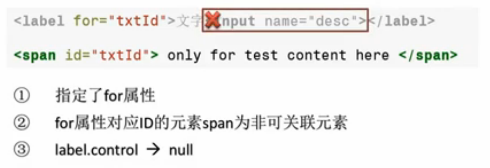

**可关联的元素** （只读属性不可在程序中修改）

- button
- fieldset
- input
- keygen
- label
- object
- output
- select
- textarea

NOTE：修改关联元素所归属的表单则可以修改元素的 `form` 属性从而调试元素所归属的表单（元素中对于的`for`属性也将被对于的调成）。

```javascript
label.setAttribute('form', 'newForm');
```

##### input 元素

```html
<input type="text">
```

`type` 可用于控制控件的*外观*以及*数据类型*（默认为 `text`），在不同的浏览器不同数据类型有不同的战士效果。

*本地图片预览示例*

所需技术点

- onchange
- accept
- multiple
- files

```html
<input type="file" accept="image/*" multiple>
```

```javascript
file.addEventListener(
  'change', function(event){
      var files = Array.prototype.slice.call(
        event.target.files, 0
      );
      files.forEach(function(item){
        files2dataurl(item. function(url){
          var image = new Image();
          parent.appendChild(image);
          Image.src = url;
        });
      });
  }
);
```

NOTE：`accept` 所支持的格式有 `audio/*` `video/*` `image/*` 以及不带`;`的 MINE Type 类型和 `.` 开头的文件名后缀的文件。多个文件类型可以使用`,`分隔。

##### select 元素

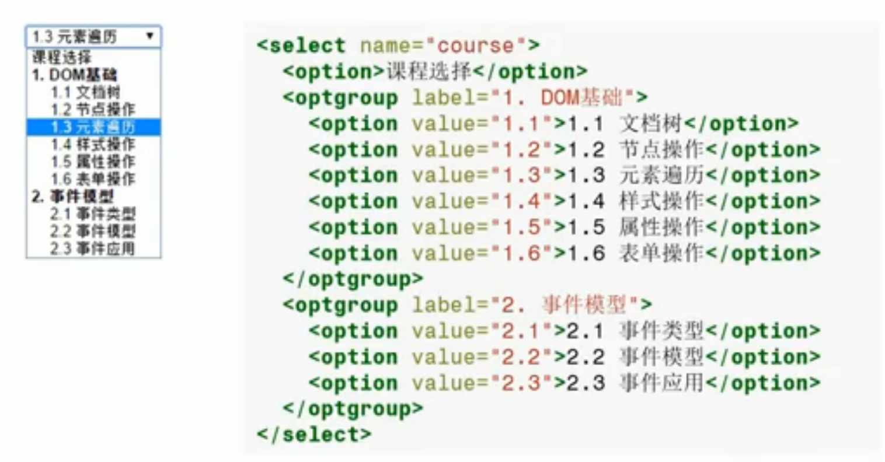

指定选项列表中选择需要的选项。

主要的三个标签 `select`、`optgroup`（用于选项分组）、`option`。

`select` 具有的属性和方法如下：

- name
- value
- multiple
- options（动态节点集合）
- selectedOptions（动态节点集合）
- selectedIndex
- add(element[, before])（无指定参照物则添加至最末端）
- remove([index])

`optgroup` 所具有的属性和方法：

- disabled （分组选项不可选）
- label（分组说明）

`option` 所具有的属性和方法：

- disabled
- label（描述信息）
- value（提交表单时的数据信息）
- text（用户看到的文字）
- index
- selected
- defaultSelected

###### 选项操作

**创建选项**

```javascript
document.createElement('option')
// 或者
new Option([text[, value[, defaultSelected[, selected]]]])
```

**添加选项**

```javascript
var option = new Option('sample');
opt.insertAdjacentElement(option, '参照元素');
// 或者
select.add(option, '参照元素')
```

**顺出选项**

```javascript
opt.parentNode.removeChild(option);
// 或者使用它的索引将其删除
select.remove(2);
```

###### 级联下列选择器

所需知识点:

- onchange
- remove
- add

```html
<form name="course">
  <select name="chapter">
    <option>Select0</option>
  </select>
  <select name="section">
    <option>Select1</option>
  </select>
</form>
```

```javascript
var chapters = {
  {text: 1, value: 1},
  {text: 2, value: 2}
};
var sections = {
  1: [{
    text:1.1, value: 1.1
  }, {
    text:1.2, value: 1.2
  }],
  2:[{
    text:2.1, value:2.1;
  }]
};

function fillSelect(select, list) {
  for(var i = select.length; i > 0; i--) {
    select.remove(i);
  }
  list.forEach(function(data){
    var option = new Option(data.text, data.value);
    select.add(option);
  })
}

fileSelect(chapterSelect, chapters);
chapterSelect.addEventListener(
  'change', function(event) {
    var value = event.target.value,
        list = sections[value] || [];
    fillSelect(sectionSelect, list);
  }
);
```

##### textarea 元素

`textarea` 具有的属性和方法如下：

- name
- value （用户输入信息）
- select() （全选当前输入的内容）
- selectionStart （选中的内容的起始位置，无选中时返回当前光标所在位置）
- selectionEnd （选中内容结束位置，无选中时返回光标位置）
- selectionDirection （选取方向 `forward` `backward`）
- setSelectionRange(start, end[, direction]) （使用程序选中内容）
- setRangeText(replacement[, start, end, [mode]]) （设置内容范围）

###### selection

表示选择区域，对于 `input` 元素同样有效。

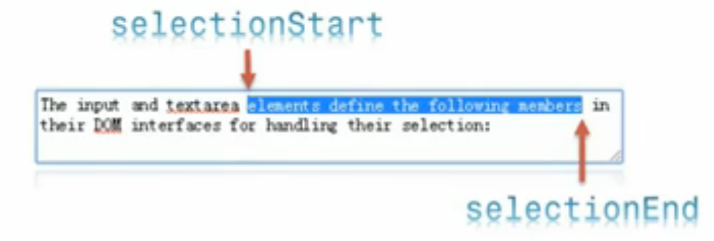

`selectionDirection` 主要是用于在使用 SHIFT 键与方向键组合选取时的选取方向。设置为 `forward` 时选取移动的方向为 `selectionEnd` 设置为 `backward` 时移动方向为 `selectionStart`。

*@输入提示示例*

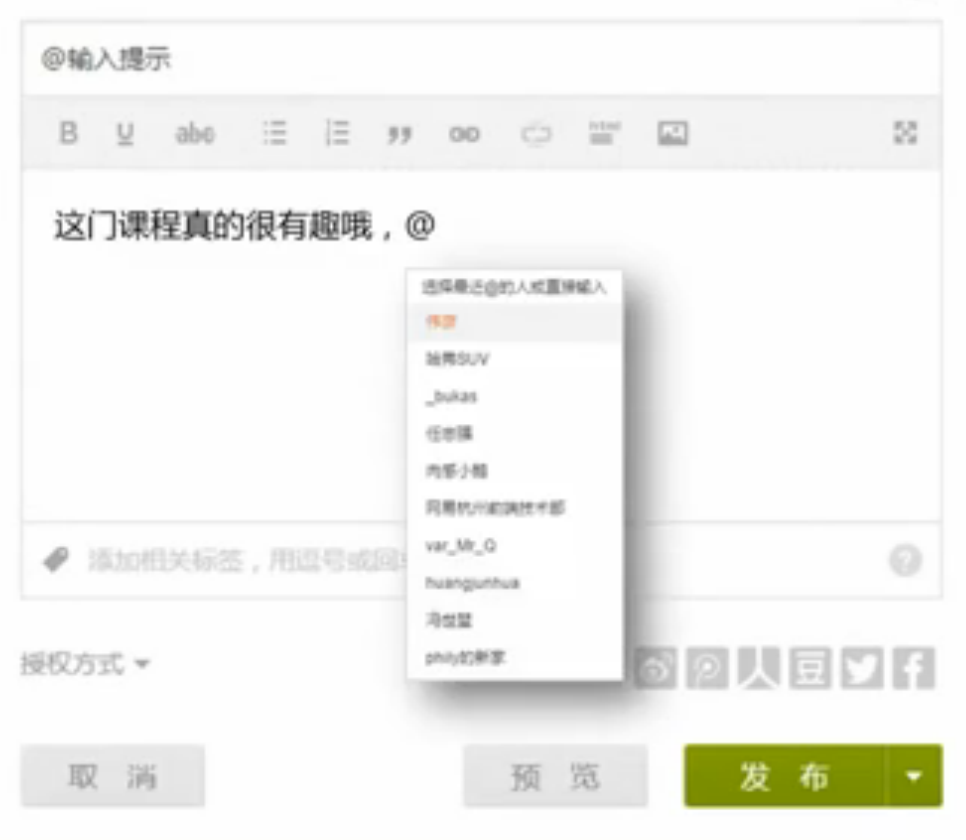

所需知识点：

- oninput
- selectionStart
- setRangeText

```javascript
textarea.addEventListener(
  'input', function(event) {
    var target = event.target,
        cursor = target.selectionStart;
    if(target.value.charAt(cursor-1) === '@') {
      doShowAtList(functi=on(name){
        var end = cursor + name.length;
        target.setRangeText(
          name, cursor, end, 'end'
        );
      });
    }
  }
);
```

##### 其他元素

- fieldset
- button
- keygen
- output
- progress
- meter


#### 验证

可以被验证的元素如下所示：】

- button
- input
- select
- textarea

以下情况不可以做验证

- input 元素在类型是 hidden, reset, button 时
- button 元素在类型为 reset, button 时
- input 与 textarea 当属性为 readonly 时
- 当元素为 datalist 的子孙节点时
- 当元素被禁用时 disabled 的状态

##### 属性

验证涉及到以下的以下属性，在每一个可以验证的元素上均可以调用对于的属性或通过接口进行操作：

- willValidate （表明此元素在表单提交时是否会被验证）
- checkValidity() （用于验证元素，返回 true 当验证通过，或者触发 invalid 事件）
- validity （存储验证结果）
- validationMessage （显示验证异常信息）
- setCustomValidity(message) （自定义验证错误信息）

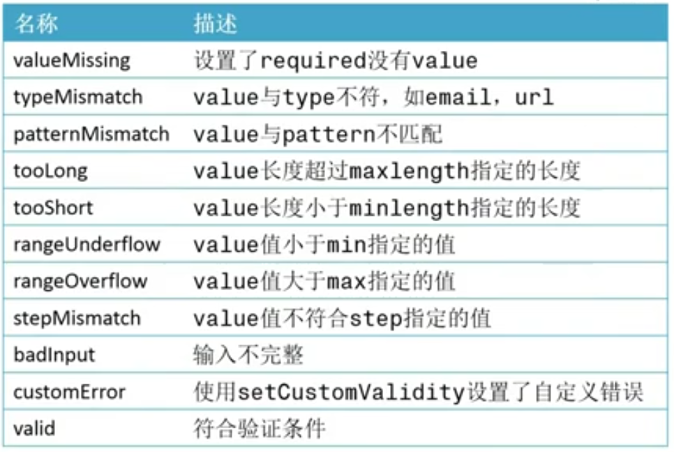

*自定义异常范例*

涉及到的知识点：

- oninvalid
- setCustomValidity

```html
<form action="./api" method="post">
  <label>Name: <input name="username" required></label>
  <button>submit</button>
</form>
```

```javascript
input.addEventListener(
  'invalid', function(event){
    var target = event.target;
    if (target.validity.valueMissing) {
      target.setCustomValidity('Name is missing');
    }
  }
)
```

*禁止验证范例*

使用 `form` 中 `novalidate` 属性来禁止表单提交的验证。

```html
<form action="./api" method="post" novalidate>
  <label>Mobile: <input name="mobile" type="number"></label>
  <button>submit</button>
</form>
```

#### 提交

##### 隐式提交

在操作过程中通过控件的操作来提交表单（敲击回车来提交表单），其需要满足以下的条件：
- 表单有非禁用的提交按键
- 没有提交按键时，不超过一个类型为 `text` `search` `url` `email` `password` `date` `time` `number` 的 `input` 元素

##### 提交过程细节

提交过程分为两个阶段，第一个阶段是更具表单 enctype 指定的值构建要提交的数据，第二个阶段是使用指定的方法（method）发送数据到 `action` 指定的目标。

*构建提交数据*，从可提交元素中提取数据组成指定数据结构过程（可提交元素有 `button` `input` `keygen` `object` `select` `textarea`）

*编码方式*（enctype）所支持的形式：

- application/x-www-form-urlencoded （默认，数据格式为 `&` 分隔的键值对）
- multipart/form-data （IFC 2388 字节流形式，例如文件上传所使用的数据编码形式）
- text/plain （回车换行符分隔的键值对）

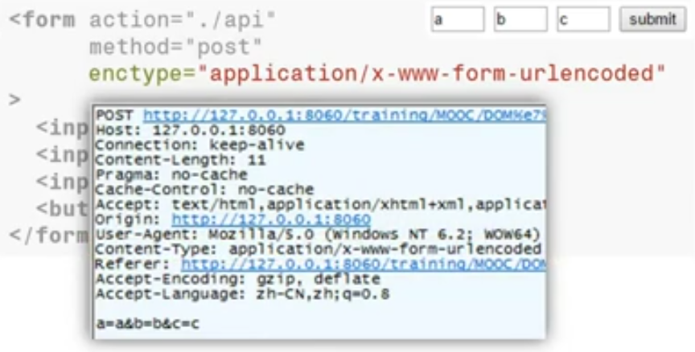

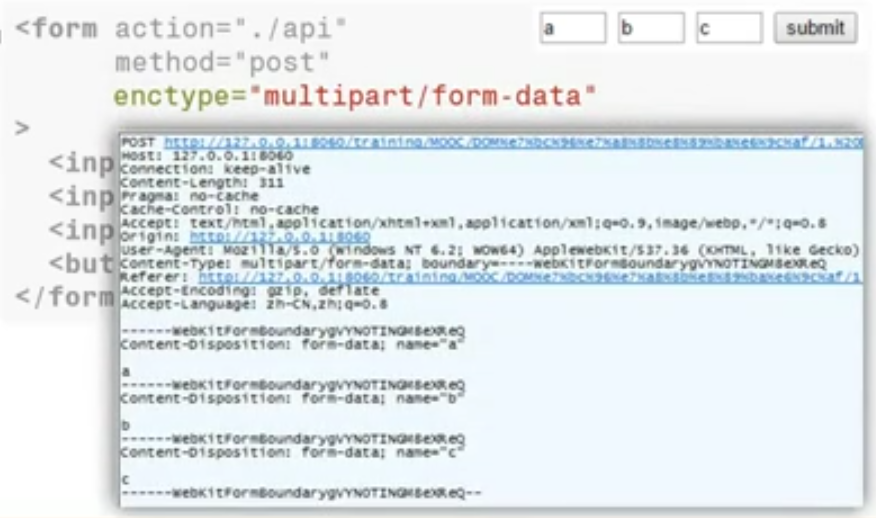

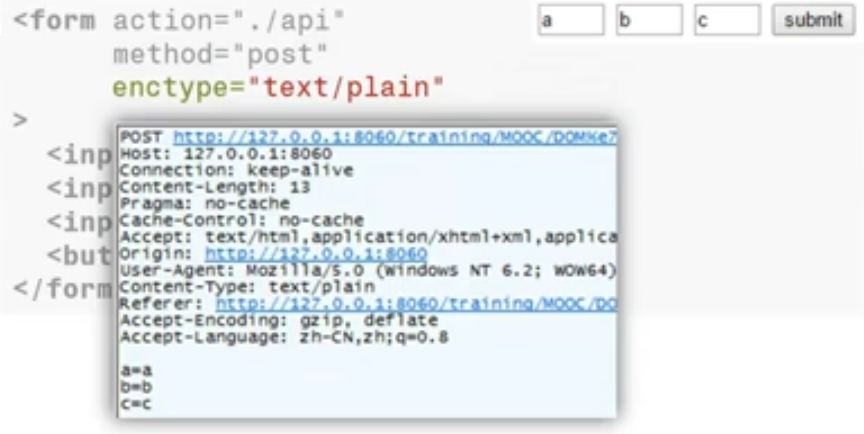

*特殊案例一*

当一个表单元素 `name="isindex"` 并且 `type="text"` 而且满足如下要求时：

- 编码格式为 application/x-www-form-urlencoded
- 作为表单的第一个元素

则提交时只发送 value 值，不包含 name。

```html
<form action="./api" method="post">
  <input name="isindex">
  <input name="a">
  <button>submit</button>
</form>
```


*特殊案例二*

当 `name="_charset_"` 并且类型为 `hidden` 时，而且满足如下要求时：

- 没有设置 `value` 值

则提交时 `value` 自动使用当前提交的字符集填充。


###### submit 接口

`form.submit()` 可以通过调用接口`submit()`直接提交表单，在提交表单时均会触发一个 `onsubmit` 表单提交事件，在这个事件中 women 可以做下面的事件：

- 提交前的数据验证
- 阻止事件的默认行为来取消表单的提交（例如当验证失败时）

```javascript
form.addEventListener(
  'submit', function(event) {
    var notValid = false;
    var elements = event.target.elements;

    // 自定义验证

    if (notValid) {
      // 取消提交
      event.preventDefault();
    }
  }
)
```

*无刷新表单提交范例*

常用的方式是通过 AJAX 进行实现，这里我们使用 iframe 来做中介代理实现。

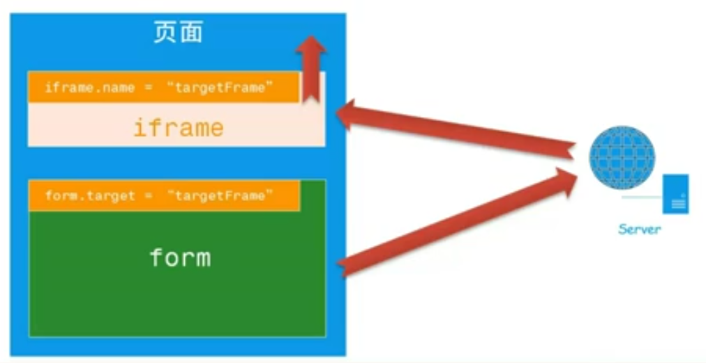

所需知识点：

- form
- target
- iframe

```html
<iframe name="targetFrame" class="f-hidden" style="display:none" id="result">

<form action="./api" method="post" target="targetFrame">
  <input name="isindex">
  <input name="a">
  <button>submit</button>
</form>
```

```javascript
var frame = document.getElementById('result');
frame.addEventListener(
  'load', function(event) {
    try {
      var result = JSON.parse(
        frame.contentWindow.document.body.textContent
      );

      // 还原登陆按钮状态
      disabledSubmit(false);

      // 识别登陆结果
      if (result.code === 200) {
        showMessage('j-suc', 'success');
        form.reset();
      }
    } catch(ex) {
      // 忽略操作
    }
  }
)
```

### 表单应用

首先需要知道服务器端登陆接口的相关信息，如下所示：

|描述|数据信息|
|----|--------|
|请求地址|/api/login|
|请求参数|`telephone` 手机号码; `password` 密码 MD5 加密|
|返回结果|`code` 请求状态; `result` 请求数据结果|

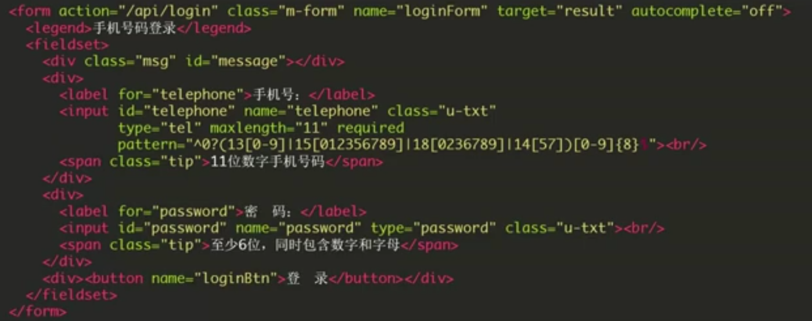

```javascript
var form = document.forms.loginForm;

var message = document.getElementById('message');

// 通用逻辑封装
function showMessage(class, message) {
  if(!class) {
    message.innerHTML = "";
    message.classList.remove('j-suc');
    message.classList.remove('j-err');
  } else {
    message.innerHTML = message;
    message.classList.add(class);
  }
}

function invalidInput (node, message) {
  showMessage('j-err', message);
  node.classList.add('j-err');
  node.focus();
}

function clearInvalid(node){
  showMessage();
  node.classList.remove('j-err');
}

function disabledSubmit(disabled) {
  form.loginBtn.disabled = !!disabled;
  var method = !disabled ? 'remove' : 'add';
  form.loginBtn.classList[method]('j-disabled');
}

// 验证手机号码（系统自带方法）
form.telephone.addEventListener(
  'invalid', function(event) {
    event.preventDefault();
    invalidInput(form.telephone, 'invalid mobile number');
  }
);

// 验证密码
form.addEventListener(
  'submit', function(event) {
    var input = form.password;
    var password = input.value;
    errorMessage = '';
    if (password.length < 6) {
      errorMessage = 'password less than 6 char';
    } else if (!/\d./test(password) || !/[a-z]/i.test(password)) {
      errorMessage = 'password must contains number and letter'
    }

    if (!!errorMessage) {
      event.preventDefault();
      invalidInput(input, errorMessage);
      return;
    }
    // 提交表单代码
    // ...
  }
);

// 提交表单
form.addEventListener(
  'submit', function(event){
    input.value = md5(password);
    disabledSubmit(true);
  }
);

// 状态恢复
form.addEventListener(
  'focus', function(event) {
    // 错误还原
    clearInvalid(event.target);
    // 还原登陆按钮状态
    disabledSubmit(false);
  }
)
```
