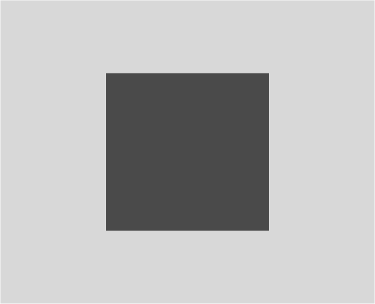
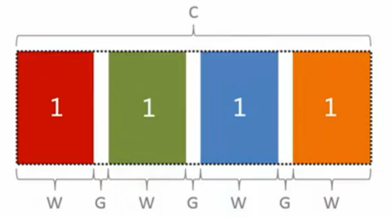
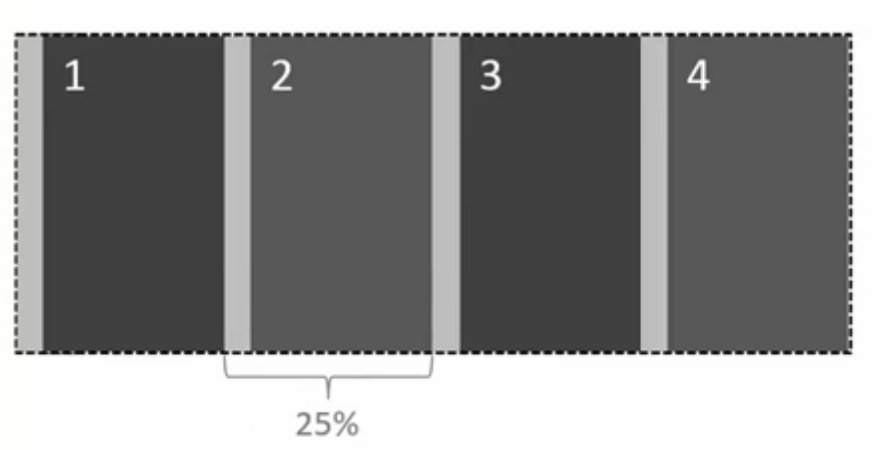
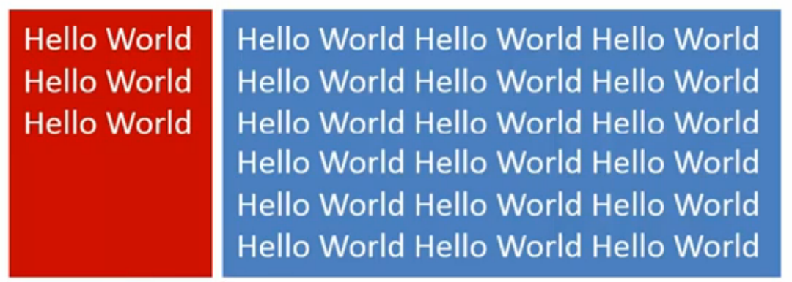
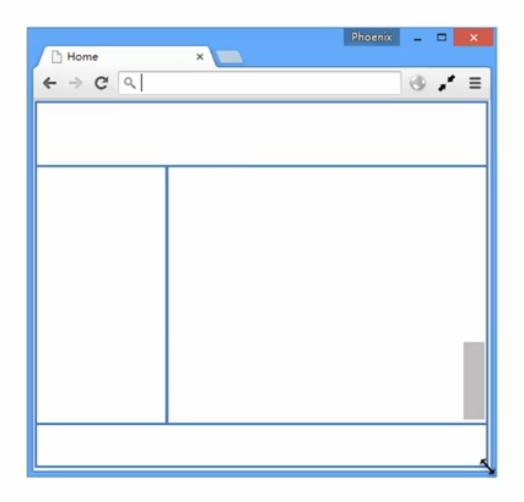
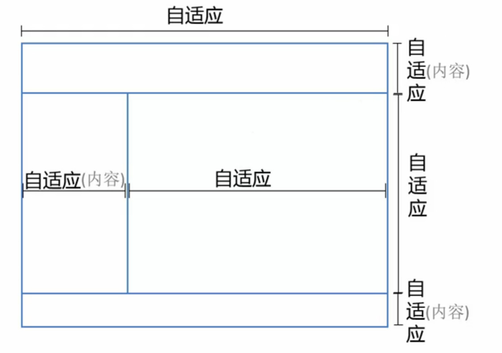

# 布局解决方案
了解 CSS 中属性的值及其特性， 透彻分析问题和需求才可以选择和设计最适合的布局解决方案。

## 居中布局

### 水平居中


子元素于父元素水平居中且其（子元素与父元素）宽度均可变。

#### inline-block + text-align

```html
<div class="parent">
  <div class="child">Demo</div>
</div>

<style>
  .child {
    display: inline-block;
  }
  .parent {
    text-align: center;
  }
</style>
```

**优点**
- 兼容性佳（甚至可以兼容 IE 6 和 IE 7）

#### table + margin

```html
<div class="parent">
  <div class="child">Demo</div>
</div>

<style>
  .child {
    display: table;
    margin: 0 auto;
  }
</style>
```

NOTE: `display: table` 在表现上类似 `block` 元素，但是宽度为内容宽。

**优点**
- 无需设置父元素样式 （支持 IE 8 及其以上版本）

NOTE：兼容 IE 8 一下版本需要调整为 `<table>` 的结果

#### absolute + transform

```html
<div class="parent">
  <div class="child">Demo</div>
</div>

<style>
  .parent {
    position: relative;
  }
  .child {
    position: absolute;
    left: 50%;
    transform: translateX(-50%);
  }
</style>
```

**优点**
- 绝对定位脱离文档流，不会对后续元素的布局造成影响。

**缺点**
- `transform` 为 CSS3 属性，有兼容性问题

#### flex + justify-content

```html
<div class="parent">
  <div class="child">Demo</div>
</div>

<style>
  .parent {
    display: flex;
    justify-content: center;
  }

  /* 或者下面的方法，可以达到一样的效果 */

  .parent {
    display: flex;
  }
  .child {
    margin: 0 auto;
  }
</style>
```

**优点**
- 只需设置父节点属性，无需设置子元素

**缺点**
- 有兼容性问题

### 垂直居中


子元素于父元素垂直居中且其（子元素与父元素）高度均可变。

#### table-cell + vertical-align

```html
<div class="parent">
  <div class="child">Demo</div>
</div>

<style>
  .parent {
    display: table-cell;
    vertical-align: middle;
  }
</style>
```

**优点**
- 兼容性好（支持 IE 8，一下版本需要调整页面结构至 `table`）

#### absolute + transform

```html
<div class="parent">
  <div class="child">Demo</div>
</div>

<style>
  .parent {
    position: relative;
  }
  .child {
    position: absolute;
    top: 50%;
    transform: translateY(-50%);
  }
</style>
```

**优点**
- 绝对定位脱离文档流，不会对后续元素的布局造成影响。

**缺点**
- `transform` 为 CSS3 属性，有兼容性问题

#### flex + align-items

```html
<div class="parent">
  <div class="child">Demo</div>
</div>

<style>
  .parent {
    display: flex;
    align-items: center;
  }
</style>
```

**优点**
- 只需设置父节点属性，无需设置子元素

**缺点**
- 有兼容性问题

### 水平与垂直居中



子元素于父元素**垂直及水平**居中且其（子元素与父元素）高度宽度均可变。

#### inline-block + text-align + table-cell + vertical-align

```html
<div class="parent">
  <div class="child">Demo</div>
</div>

<style>
  .parent {
    text-align: center;
    display: table-cell;
    vertical-align: middle;
  }
  .child {
    display: inline-block;
  }
</style>
```

**优点**
- 兼容性好

#### absolute + transform

```html
<div class="parent">
  <div class="child">Demo</div>
</div>

<style>
  .parent {
    position: relative;
  }
  .child {
    position: absolute;
    left: 50%;
    top: 50%;
    transform: translate(-50%, -50%);
  }
</style>
```

**优点**
- 绝对定位脱离文档流，不会对后续元素的布局造成影响。

**缺点**
- `transform` 为 CSS3 属性，有兼容性问题

#### flex + justify-content + align-items

```html
<div class="parent">
  <div class="child">Demo</div>
</div>

<style>
  .parent {
    display: flex;
    justify-content: center;
    align-items: center;
  }
</style>
```

**优点**
- 只需设置父节点属性，无需设置子元素

**缺点**
- 有兼容性问题

## 多列布局
多列布局在网页中非常常见（例如两列布局），多列布局可以是两列定宽，一列自适应， 或者多列不定宽一列自适应还有等分布局等。

### 一列定宽，一列自适应


#### float + margin

```html
<div class="parent">
  <div class="left">
    <p>left</p>
  </div>
  <div class="right">
    <p>right</p>
    <p>right</p>
  </div>
</div>

<style>
  .left {
    float: left;
    width: 100px;
  }
  .right {
    margin-left: 100px
    /*间距可再加入 margin-left */
  }
</style>
```

NOTE：IE 6 中会有3像素的 BUG，解决方法可以在 `.left`
加入 `margin-left:-3px`。

#### float + margin + (fix) 改造版

```html
<div class="parent">
  <div class="left">
    <p>left</p>
  </div>
  <div class="right-fix">
    <div class="right">
      <p>right</p>
      <p>right</p>
    </div>
  </div>
</div>

<style>
  .left {
    float: left;
    width: 100px;
  }
  .right-fix {
    float: right;
    width: 100%;
    margin-left: -100px;
  }
  .right {
    margin-left: 100px
    /*间距可再加入 margin-left */
  }
</style>
```

NOTE：此方法不会存在 IE 6 中3像素的 BUG，但 `.left` 不可选择，
需要设置 `.left {position: relative}` 来提高层级。
此方法可以适用于多版本浏览器（包括 IE6）。缺点是多余的 HTML 文本结构。

#### float + overflow

```html
<div class="parent">
  <div class="left">
    <p>left</p>
  </div>
  <div class="right">
    <p>right</p>
    <p>right</p>
  </div>
</div>

<style>
  .left {
    float: left;
    width: 100px;
  }
  .right {
    overflow: hidden;
  }
</style>
```

设置 `overflow: hidden` 会触发
BFC 模式（Block Formatting Context）块级格式化文本。
BFC 中的内容**与外界的元素是隔离的**。

**优点**

- 样式简单

**缺点**

- 不支持 IE 6

#### table

```html
<div class="parent">
  <div class="left">
    <p>left</p>
  </div>
  <div class="right">
    <p>right</p>
    <p>right</p>
  </div>
</div>

<style>
  .parent {
    display: table;
    width: 100%;
    table-layout: fixed;
  }
  .left {
    display: table-cell;
    width: 100px;
  }
  .right {
    display: table-cell;
    /*宽度为剩余宽度*/
  }
</style>
```

`table` 的显示特性为每列的单元格宽度合**一定**等与表格宽度。
`table-layout: fixed;` 可加速渲染，也是设定布局优先。

NOTE：`table-cell` 中不可以设置 `margin` 但是可以通过 `padding` 来设置间距。

#### flex

```html
<div class="parent">
  <div class="left">
    <p>left</p>
  </div>
  <div class="right">
    <p>right</p>
    <p>right</p>
  </div>
</div>

<style>
  .parent {
    display: flex;
  }
  .left {
    width: 100px;
    margin-left: 20px;
  }
  .right {
    flex: 1;
    /*等价于*/
    /*flex: 1 1 0;*/
  }
</style>
```

NOTE：`flex-item` 默认为内容宽度。

**缺点**

- 低版本浏览器兼容问题
- 性能问题，只适合小范围布局。

### 两列定宽，一列自适应


```html
<div class="parent">
  <div class="left">
    <p>left</p>
  </div>
  <div class="center">
    <p>center<p>
  </div>
  <div class="right">
    <p>right</p>
    <p>right</p>
  </div>
</div>

<style>
  .left, .center {
    float: left;
    width: 100px;
    margin-right: 20px;
  }
  .right {
    overflow: hidden;
    /*等价于*/
    /*flex: 1 1 0;*/
  }
</style>
```

多列定宽的实现可以更具单列定宽的例子进行修改与实现。


### 一列不定宽加一列自适应


不定宽的宽度为内容决定，下面为可以实现此效果的方法：

- `float` + `overflow`，此方法在 IE6 中有兼容性问题
- `table`，此方法在 IE6 中有兼容性问题
- `flex`，此方法在 IE9及其以下版本中有兼容性问题

### 多列不定宽加一列自适应


其解决方案同*一列不定宽加一列自适应*相仿。

### 多列等分布局


每一列的宽度和间距均相等，下面为多列等分布局的布局特定。



父容器宽度为 C，`C = W * N + G * N - G` => `C + G = (W + G) * N`。


#### float



```html
<div class="parent">
  <div class="column">
    <p>1</p>
  </div>
  <div class="column">
    <p>2</p>
  </div>
  <div class="column">
    <p>3</p>
  </div>
  <div class="column">
    <p>4</p>
  </div>
</div>
<style media="screen">
  .parent {
    margin-left: -20px;
  }
  .column {
    float: left;
    width: 25%;
    padding-left: 20px;
    box-sizing: border-box;
  }
</style>
```

NOTE：此方法可以完美兼容 IE8 以上版本。
NOTE+：此方法结构和样式具有耦合性。

#### table

```html
<div class='parent-fix'>
  <div class="parent">
    <div class="column">
      <p>1</p>
    </div>
    <div class="column">
      <p>2</p>
    </div>
    <div class="column">
      <p>3</p>
    </div>
    <div class="column">
      <p>4</p>
    </div>
  </div>
</div>

<style media="screen">
  .parent-fix {
    margin-left: -20px;
  }
  .parent {
    display: table;
    width: 100%;
    /*可以布局优先，也可以单元格宽度平分在没有设置的情况下*/
    table-layout: fixed;
  }
  .column {
    display: table-cell;
    padding-left: 20px;
  }
</style>
```

NOTE：缺点是多了文本结果

#### flex

```html
<div class="parent">
  <div class="column">
    <p>1</p>
  </div>
  <div class="column">
    <p>2</p>
  </div>
  <div class="column">
    <p>3</p>
  </div>
  <div class="column">
    <p>4</p>
  </div>
</div>


<style media="screen">
  .parent {
    display: flex;
  }
  .column {
    /*等价于 flex: 1 1 0;*/
    flex: 1;
  }
  .column+.column {
    margin-left: 20px;
  }
</style>
```

NOTE：`flex` 的特性为分配剩余空间。
NOTE+：兼容性有问题。

###



#### table

`table` 的特性为每列等宽，每行等高可以用于解决此需求。

```html
<div class="parent">
  <div class="left">
    <p>left</p>
  </div>
  <div class="right">
    <p>right</p>
    <p>right</p>
  </div>
</div>

<style>
  .parent {
    display: table;
    width: 100%;
    table-layout: fixed;
  }
  .left {
    display: table-cell;
    width: 100px;
  }
  .right {
    display: table-cell;
    /*宽度为剩余宽度*/
  }
</style>
```

#### flex

```html
<div class="parent">
  <div class="left">
    <p>left</p>
  </div>
  <div class="right">
    <p>right</p>
    <p>right</p>
  </div>
</div>

<style>
  .parent {
    display: flex;
  }
  .left {
    width: 100px;
    margin-left: 20px;
  }
  .right {
    flex: 1;
    /*等价于*/
    /*flex: 1 1 0;*/
  }
</style>
```

NOTE：flex 默认的 `align-items` 的值为 `stretch`。

#### float

```html
<div class="parent">
  <div class="left">
    <p>left</p>
  </div>
  <div class="right">
    <p>right</p>
    <p>right</p>
  </div>
</div>

<style>
  .parent {
    overflow: hidden;
  }
  .left,
  .right {
    padding-bottom: 9999px;
    margin-bottom: -9999px;
  }
  .left {
    float: left;
    width: 100px;
    margin-right: 20px;
  }
  .right {
    overflow: hidden;
  }
</style>
```

NOTE：此方法为伪等高（只有背景显示高度相等），左右真实的高度其实不相等。
NOTE+：此方法兼容性较好。

## 全屏布局



例如管理系统，监控与统计平台均广泛的使用全屏布局。

### 定宽需求


**实现方案**

- Position 常规方案
- Flex CSS3 新实现

#### Position

```html
<div class="parent">
  <div class="top"></div>
  <div class="left"></div>
  <div class="right">
    /*辅助结构用于滚动*/
    <div class="inner"></div>
  </div>
  <div class="bottom"></div>
</div>
<style>
  html,
  body,
  .parent {
    height: 100%;
    /*用于隐藏滚动条*/
    overflo: hidden;
  }
  .top {
    /*相对于 body 定位*/
    position: absolute;
    top: 0;
    left: 0;
    right: 0;
    height: 100px;
  }
  .left {
    position: absolute;
    left: 0;
    top: 100px;
    bottom: 50px;
    width: 200px;
  }
  .right {
    position: absolute;
    left: 200px;
    right: 0;
    top: 100px;
    bottom: 50px;
    overflow: auto;
  }
  .right .inner {
    /*此样式为演示所有*/
    min-height: 1000px;
  }
  .bottom {
    position: absolute;
    left: 0;
    right: 0;
    bottom: 0;
    height: 50px;
  }
</style>
```

##### Position 兼容

此方法不支持 IE6 可以使用下面的方法解决兼容问题。

```html
<div class="g-hd"></div>
<div class="g-sd"></div>
<div class="g-mn"></div>
<div class="g-ft"></div>
<style>
  html,
  body {
    width: 100%;
    height: 100%;
    overflow: hidden;
    margin: 0;
  }

  html {
    _height: auto;
    _padding: 100px 0 50px;
  }

  .g-hd,
  .g-sd,
  .g-mn,
  .g-ft {
    position: absolute;
    left: 0;
  }

  .g-hd,
  .g-ft {
    width: 100%;
  }

  .g-sd,
  .g-mn {
    top: 100px;
    bottom: 50px;
    _height: 100%;
    overflow: auto;
  }

  .g-hd {
    top: 0;
    height: 100px;
  }

  .g-sd {
    width: 300px;
  }

  .g-mn {
    _position: relative;
    left: 300px;
    right: 0;
    _top: 0;
    _left: 0;
    _margin-left: 300px;
  }

  .g-ft {
    bottom: 0;
    height: 50px;
  }
</style>
```


#### Flex

```html
<div class="parent">
  <div class="top"></div>
  <div class="middle">
    <div class="left"></div>
    <div class="right">
      <div class="inner"></div>
    </div>
  </div>
  <div class="bottom"></div>
</div>
<style media="screen">
  html,
  body,
  parent {
    height: 100%;
    overflow: hidden;
  }

  .parent {
    display: flex;
    flex-direction: column;
  }

  .top {
    height: 100px;
  }

  .bottom {
    height: 50px;
  }

  .middle {
    // 居中自适应
    flex: 1;
    display: flex;
    /*flex-direction: row 为默认值*/
  }

  .left {
    width: 200px;
  }

  .right {
    flex: 1;
    overflow: auto;
  }
  .right .inner {
    min-height: 1000px;
  }
</style>
```

##### Flex 兼容性

CSS3 中的新概念所有 IE9 及其也行版本都不兼容。

### 百分比宽度需求


只需把定宽高（`px` 为单位的值）的实现改成百分比（%）既可。

### 内容自适应



只有右侧栏占据剩余位置，其余空间均需根据内容改变。
所以 Postion 的定位方法不适合实现此方案。下面列出了两种布局方案：

- Flex
- Grid，W3C 草案并不稳定，浏览器支持也并不理想

#### Flex

只有不为宽高做出限制，既可对其中的内容做出自适应的布局。

```html
<div class="parent">
  <div class="top"></div>
  <div class="middle">
    <div class="left"></div>
    <div class="right">
      <div class="inner"></div>
    </div>
  </div>
  <div class="bottom"></div>
</div>

<style media="screen">
  html,
  body,
  parent {
    height: 100%;
    overflow: hidden;
  }

  .parent {
    display: flex;
    flex-direction: column;
  }

  .middle {
    // 居中自适应
    flex: 1;
    display: flex;
    /*flex-direction: row 为默认值*/
  }

  .right {
    flex: 1;
    overflow: auto;
  }
  .right .inner {
    min-height: 1000px;
  }
</style>
```

### 方案比较

|方案|兼容性|性能|自适应|
|---|-----|----|-----|
|Position|好|好|部分自适应|
|Flex|较差|差|可自适应|
|Grid|差|较好|可自适应|
