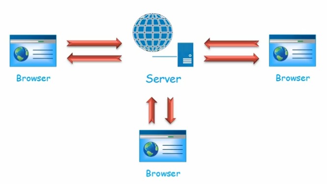
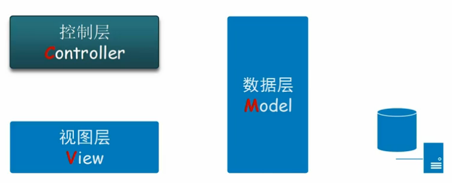
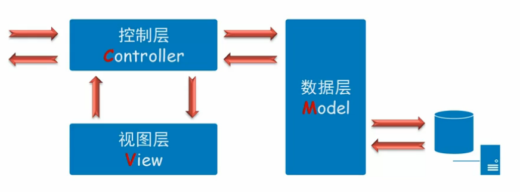
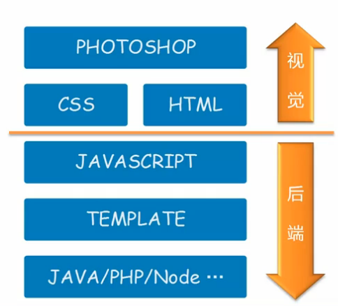
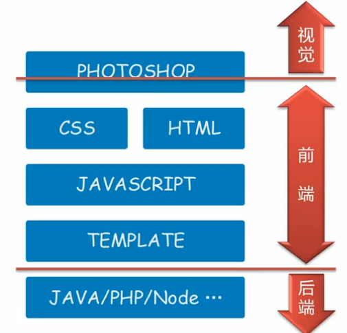

## 协作流程

### Web 系统

Web 系统部署在服务器上为提出不同需求的外部客户端服务。

**MVC** (Model, View, Controller) 它们分别代表**数据层**，**视图层**，
和**控制层**。

- 数据层，封装数据管理操作（例如数据的 CRUD ）
- 视图层，展示数据模型提供人机交互
- 控制层，处理用户请求，委托数据层，选择视图层进行展示

NOTE：CRUD 代表 Create、Read、Update、Delete。

下面以用户请求页面为例：

1. 客户端发送请求，服务器**控制层**接受到请求
1. 请求**数据层**获取数据，返回**控制层**
1. **控制层**根据数据选择合适的**视图层**进行展示
1. **视图层**生成页面代码，返回**控制层**
1. **控制层**返回客户端进行展示

#### 技术栈全览

- Photoshop，获取图片资源
- CSS 与 HTML，制作页面
- JavaScript 前端交互逻辑
- Template 结构与内容分离整合
- Java/PHP/Node 后端逻辑

**弊端**

- 后期维护性差（相同内容，不同形成存在）
- 专业化程度低
- 需求响应速度慢

**前端工程师新责任**

随着视图层也会存在业务逻辑的需求，前端工程师也会参与到业务逻辑的实现中去。
这样使前端工程师可以在后期转换成**全栈工程师**（Fullstack Developer)。
